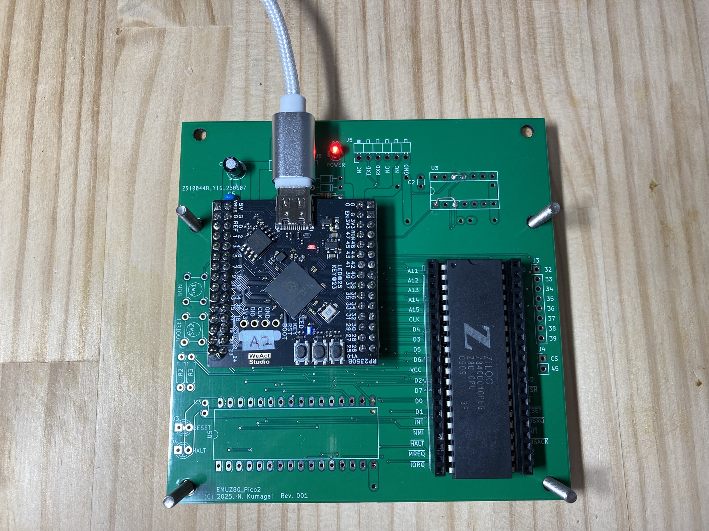
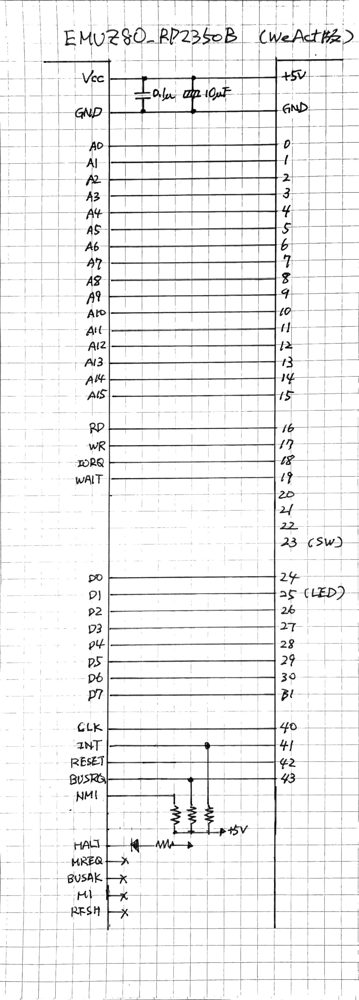
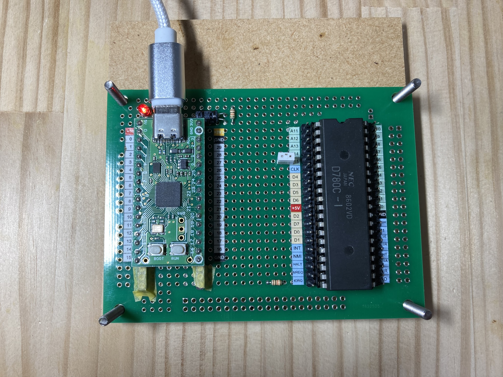
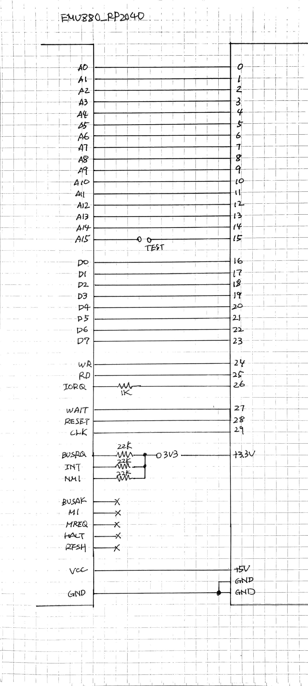
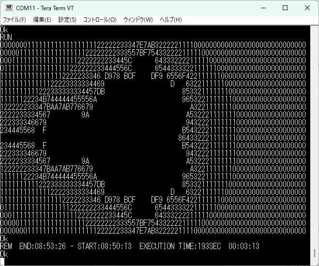
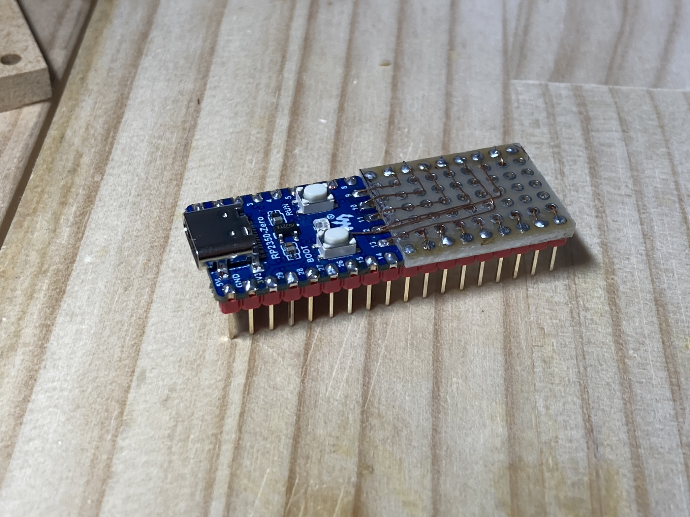
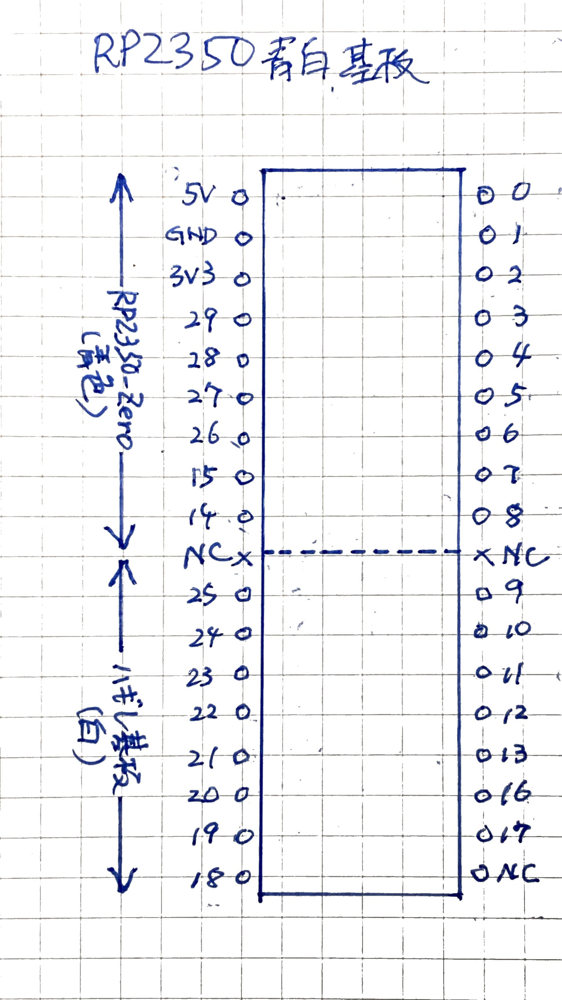

# emuz80_pico2 ... A Z80 manipulator on Raspberry Pi Pico2

Z80 を RP2350B を使用して駆動します。Z80 と WeAct RP2350B Core Board (Raspberry Pi RP2350B chip board) の2デバイスのみで実現しています。

電脳伝説(Twitter @vintagechips)さんに敬意を表して、かの名作 EMUZ80 のシンプルさを再現すべく、Z80 と DIPデバイス(秋月AE-RP2040)のみで秋月B基板サイズで実現したバージョンも用意しました。

Z80 駆動に先立ち、必要な要素機能の動作確認も兼ねて、ROM エミュレータの試作も行いました。その試行結果は、[ROM_EMULATION.md](doc/ROM_EMULATION.md) に記載してあります。ソースコードはブランチ `rom_emulation` を参照ください。

RP2350B版の試作基板と回路図はこんな感じです。
Pico2 の開発環境を整えて、PIO プログラミングを試行し、WAIT 発生回路、クロックジェネレータ、UARTシミュレーションを作成し、EMUBASIC を動作させ、ASCIIART.BAS を走らせるところまで進めました。

<div style="frame">


</div>

AE-RP2040 版の試作基板と回路図は以下の通りです。RP2040 の GPIO 30 本すべてを使用しています。TESTピン1本を割り当てる余裕もありません。

<div style="frame">


</div>

どちらも EMUBASIC(IORW改造版)の上で ASCIIART.BAS 実行ができています。



RP2350B版(150MHz駆動)で、Z80クロック 6.25MHz/ASCIIART.BAS実行時間 3分13秒、AE_RP2040 版(125MHz駆動)で、Z80クロック4.16MHz/で動作します。ASCIIART.BAS実行時間は、4分49秒でした。

Z80チップの種類により、ここまでの速度は出ないかもしれません。上記は NEC upd781-1 だが、Zilog 10MHz C-MOS Z80 の場合は分周比 14.0(5.35MHz) でかろうじて安定動作しました。

## 状況・使い方

* EMUBASIC 実行ができるようになりました。
* メモリ64kB、Read/Write できます(RDからのアクセスタイム 140ns/WRからのアクセスタイム160ns)
* メモリリード・ライトサイクルはノーウェイトです。ウェイトを入れずにプログラムを単純化・高速化していますので、クロックを上げすぎると暴走します。
* シリアルポート機能(I/Oポート)
  + アドレス00H:RO: ステータスレジスタ(bit0: RxRDY, bit1: TxRDY)
  + アドレス01H:RW: データレジスタ
* EMUBASIC ファームを RAM 配列に転送して、Z80 リセット解除・実行開始させます。
* 電源はマイクロUSBケーブルから供給します。
* ファームウェアもマイクロUSB接続で焼きこみます。
* UARTエミュレーションは USB シリアルを使用します。PC側では COM ポートとして現れます。
* RP2350Bボード/AE-RP2040ボードの BOOTROM/RUNスイッチを使いファーム焼き込みを行います。BOOTROM スイッチ押しながら RUN スイッチを押して離すとファーム焼きmodeに突入します。
* USBシリアルの場合「ハードウェアフロー制御」が効いているようで、TeraTerm の文字待ちディレイなしでも ASCIIART.BAS のアップロードができます。

開発過程は[メモ](doc/LOG.md)に残しています。

## 契機

私は、Z80 を現代マイクロコントローラの組み合わせで動作させ、古の Z80 プログラムを実行させる試みをいままで行ってきました。出会った試みの中で、EMUZ80 は特に印象深いものがありました。

[EMUZ80](https://vintagechips.wordpress.com/2022/03/05/emuz80_reference/) は電脳伝説さん(@vintegechips)の名作で、Z80 と PIC18F47Q43 の2チップだけで構成したシンプルかつエレガントな作品です。これにインスパイヤされて、多くの人がさまざまなレトロCPUを載せて動かしています。

EMUZ80 は、PIC の CLC(Configurable Logic Cells) を生かした WAIT 発生回路を特徴としています。ただ、内蔵 RAM が小さく、RAM 6kBほどのプログラムしか動かせませんでした。また、Z80 停止以外の処理を PIC ソフトで実現しており、PIC18 自体の実行速度もそれなりなので、1命令あたりの実行時間がそれなりに掛かっていたことを、個人的には少し残念に思っていました。

Raspberry Pi Pico2(RP2350A/RP2350B) は、Cortex-M3, 150MHz 駆動とそれなりに速く、RAM もふんだんに積んでおり、64kB の配列を確保することも十分可能です。なんといっても、PIO(Programmable I/O)という高速応答を行う仕組みがあるため、WAIT 発生回路を PIO で組むことができれば面白いのにと考えていました。が、自力で道を切り開く根性もなく手つかずのままになっておりました。そんなある日、私のタイムラインにさっそうと流れてきたのが、[このツイート](https://x.com/nf_ban/status/1823367824691052579)です。


ここに `wait 0, gpio 25` って書いてある。これって MREQ が 0 になるのを待つということだよね。

これを見て、これなら私も勉強すれば PIO 使えるんじゃないかと思ったわけですよ。それで、以前買っておいた [Pimoroni PGA2350](https://shop.pimoroni.com/products/pga2350?variant=42092629229651)を引っ張り出してごそごそと作りました。

* メモリリードライトサイクルも WAIT を掛けていました。クロック 3MHz あたりで WAIT が入り始めました。
* クロック 12MHz まで動作確認できました。16MHz では動作しませんでした(WAIT挿入が間に合わず、「すっこ抜ける」)

このアイディアによる実装は、 `main` ブランチのタグ `emuz80_v1.0` をチェックアウトして見てください。

```
$ git checkout emuz80_v1.0
```

クロック 3MHz あたりで WAIT が入り始めるというのは、長年の私の目標「クロック 4MHz WAIT なし」にはまだ届いていません。もう少し高速化したいと思っていました。

## 非同期式

その後、[PicoROM](https://github.com/wickerwaka/PicoROM) を調べる機会をえて、PIO を使いメモリリードを実現しつつ、アクセスタイム 70ns を実現していることを知りました。

PicoROM では、データバス出力の Hi-Z 制御とデータ出力を、`wait` 命令を使わず無限ループで実行しています。PIO もメインCPUも「待たない」実装でループ内処理を単純化することで、遅延も最小限に抑えられることを知りました。このアイディアを頂いて、改めて実装しなおしたのが「非同期式」です。これにより、メモリリード/ライト/IOアクセスの3分割により、クロック 6MHz 越えを達成できました。長年の宿願「4MHz 越え」が達成でき感無量です。

非同期式 RP2350B 版は、 `async_rb2450b` ブランチで開発しました。現在は `main` ブランチにマージしました。タグ `RP2350B_v1.1` をチェックアウトしてコードを見てください。

```
$ git checkout RP2350B_v1.1
```

この試作を経て、Z80 の CLK 端子を RP2350B に直接接続しても Z80 を駆動できることが分かりました。Z80 は CLK 端子が、H最小電圧が 3.5V で、RP2350B の電源電圧以上の電圧で駆動することを求めています。今までは、HC-MOS ゲートを咬ませてそいつに電圧を上げてもらっていたのですが、完全 2 チップではない。HC-MOS ゲートなしで CLK を駆動できるのなら、Z80 と RP2350B の 2チップで構成できるはずです。チップ仕様的には保証外なのですが、どうやら動作しているようです。2チップ構成が圧倒的に格好良いので、リスクを冒してもCLK直結すべきと考えて進めています。

## RP2350/RP2040 と 5V電源デバイスとの接続

私は以下の考えに基づいて進めています。参考文献として[このページ](https://www.cepstrum.co.jp/hobby/5v33v/5v33v.html)を挙げておきます。

* 3.3V OUT -> 5V IN: 一般的に、3.3V 電源電圧の C-MOS の場合、出力は 5V電源電圧のデバイス入力に直結してもよい。
* 入力の直結はよろしくない。10kΩ程度の抵抗を介して接続するのはOKである。
* RP2350の場合、IOVDD に電圧が印加されている場合は、GPIO0-25 は 5V OUT -> 3.3V IN でも直結して構わない(RP2350Bデータシートの"FT"端子の説明による)。GPIO26-29 の4本は10kΩ抵抗を介して接続するのが筋であるが、1kΩ抵抗で直結している例もあるので、私もそれを採用する。
* RP2040の場合、IOVDD 云々の話はデータシートに存在しない。よって 5V OUT -> 3.3V IN には10kΩ抵抗を挟むのが筋であるが、実際には直結している。壊れずに動いているからOKという考えによるもので、他人に勧められたものではない。

## EMUZ80 テイストの再現

Pico/Pico2 の PIO の使い方にある程度習熟し、Z80 と WeAct RP2350B CoreBoard とで Z80 を駆動するノウハウを得ました。するとこの2デバイスを配置した基板のデザインがしっくりこないのです。

電脳伝説さんに敬意を表しつつ [EMUZ80](https://vintagechips.wordpress.com/2022/03/05/emuz80_reference/) のシンプルな基板のテイストを Pico/Pico2 で再現したいと思いました。WeAct RP2350B CoreBoard では、真四角のため、スマートな長方形である Z80 DIP パッケージと並べて載せてもバランスが今一歩です。Z80 と DIP パッケージの2本をバランスよく並べることによる美しさを大事にしたい。

まず、Raspberry Pi Pico2 が使えないかと検討しましたが、GPIO 数では少し足りない(アドレスバス 11 本しか取れない)ことが分かりました。RP2040/RP2350A の 30本のGPIOすべてを使えることが望ましいです。

* アドレスバス 16 本
* データバス 8本
* 制御信号6本(RD,WR,IORQ,WAIT,CLK,RESET)

これで30本になります。データバス8本と制御信号6本は必須です。アドレスバスを減らすことはできますが、減らすとZ80用のROM/RAMサイズ合計が減ります。できれば16本割り当てたいところです。

秋月の AE-RP2040 が GPIO0 ～ GPIO29 まで30本すべて端子が出ていることが分かりました。RP2350A で 30本端子が出ている基板はなかなか見つからない。 @74th さんの[作品](https://74th.hateblo.jp/entry/build-my-rp2350a-board)があるのですが、RP2350A を手はんだすることが前提で、組み立てにちょっと自信がないのです。やむを得ないので、入手性を取って AE-RP2040 を使うこととしました。

> Z80側の出力 -> RP2040入力の可能性のある端子を直結しているのは動作無保証であるだけでなく、デバイス破壊の可能性があります。格好良さを重視し・かつ手元で壊れず動作しているのでここで紹介しますが、再現実験される方はリスク覚悟で取り組まれるようにお願いいたします。

ソフト実装は、ブランチ `ae_rp2040` にある通りです。RP2350A と大差はないかと思っていましたが、苦労しました。詳細は、[AE-RP2040設計メモ](./doc/AE_RP2040_DESIGNMEMO.md)を参照ください。

## RP2350A フルGPIO基板の作成

[Waveshare RP2350-Zero](https://www.waveshare.com/rp2350-zero.htm) は、GPIO16 以外の 29本がパッドまたは端子として出ています。GPIO16 は、基板搭載のカラーLED(WS2812B)のDINにつながっているので、カラーLEDからなんとかして線を1本引き出せば GPIO 30 本すべてを使用することができます。

ということで、

* 40ピン DIP パッケージと同じ幅だが、ピン数は 36ピンのパッケージを用意することができた。

<br>


詳細は、[以下のページ](./doc/RP2350A_FULLGPIO.md) を参照して欲しい。


