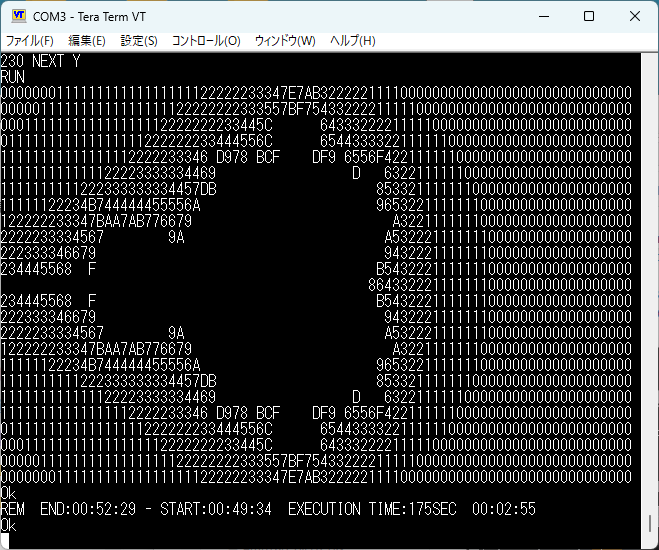

# emuz80_pico2 ... A Z80 manipulator on Raspberry Pi Pico2

かの名作 EMUZ80 を、PIC18F47Q43 の代わりに Raspberry Pi Pico2 を使って実現します。他のレトロCPU駆動機を実現するための手始め・Pico2 (とくに PIO)のトレーニングも兼ねたプロジェクトです。

Z80 駆動に先立ち、必要な要素機能の動作確認も兼ねて、ROM エミュレータの試作も行いました。その試行結果は、[ROM_EMULATION.md](doc/ROM_EMULATION.md) に記載してあります。ソースコードはブランチ `rom_emulation` を参照ください。

試作基板と回路図はこんな感じです。

Pico2 の開発環境を整えて、PIO プログラミングを試行し、WAIT 発生回路、クロックジェネレータ、UARTシミュレーションを作成し、EMUBASIC を動作させ、ASCIIART.BAS を走らせるところまで進めました。

20MHz Z80 で、12.5MHz クロックを供給し、ASCIIART.BAS を実行すると、175secで走り切ります。WAITサイクルが適宜入る(M1サイクル/MemReadサイクルで3Wait追加される)ので、クロック相応よりも遅くなります。ノーウェイト動作のとき、クロック 20MHz で 1分が相場なので、175sec は 6.87MHz 相当になります。

### 契機

私は、Z80 を現代マイクロコントローラの組み合わせで動作させ、古の Z80 プログラムを実行させる試みをいままで行ってきました。出会った試みの中で、EMUZ80 は特に印象深いものがありました。

[EMUZ80](https://vintagechips.wordpress.com/2022/03/05/emuz80_reference/) は電脳伝説さん(@vintegechips)の名作で、Z80 と PIC18F47Q43 の2チップだけで構成したシンプルかつエレガントな作品です。これにインスパイヤされて、多くの人がさまざまなレトロCPUを載せて動かしています。

EMUZ80 は、PIC の CLC(Configurable Logic Cells) を生かした WAIT 発生回路を特徴としています。ただ、内蔵 RAM が小さく、RAM 6kBほどのプログラムしか動かせませんでした。また、Z80 停止以外の処理を PIC ソフトで実現しており、PIC18 自体の実行速度もそれなりなので、1命令あたりの実行時間がそれなりに掛かっていたことを、個人的には少し残念に思っていました。

Raspberry Pi Pico は、Cortex-M3, 125MHz 駆動とそれなりに速く、RAM もふんだんに積んでおり、64kB の配列を確保することも十分可能です。なんといっても、PIO(Programmable I/O)という高速応答を行う仕組みがあるため、WAIT 発生回路を PIO で組むことができれば面白いのにと考えていました。が、自力で道を切り開く根性もなく手つかずのままになっておりました。そんなある日、私のタイムラインにさっそうと流れてきたのが、[このツイート](https://x.com/nf_ban/status/1823367824691052579)です。

ここに `wait 0, gpio 25` って書いてある。これって MREQ が 0 になるのを待つということだよね。

これを見て、これなら私も勉強すれば PIO 使えるんじゃないかと思ったわけですよ。それで、以前買っておいた [Pimoroni PGA2350](https://shop.pimoroni.com/products/pga2350?variant=42092629229651)を引っ張り出してごそごそと作り始めているのが、このリポジトリとなります。

EMUZ80 / EMUBASIC 実行ができるようになりました。メモリ Read/Write, シリアルポート機能(メモリマップドI/O)を入れています。git バージョン管理も兼ねて[メモ](doc/LOG.md)に残しています。

