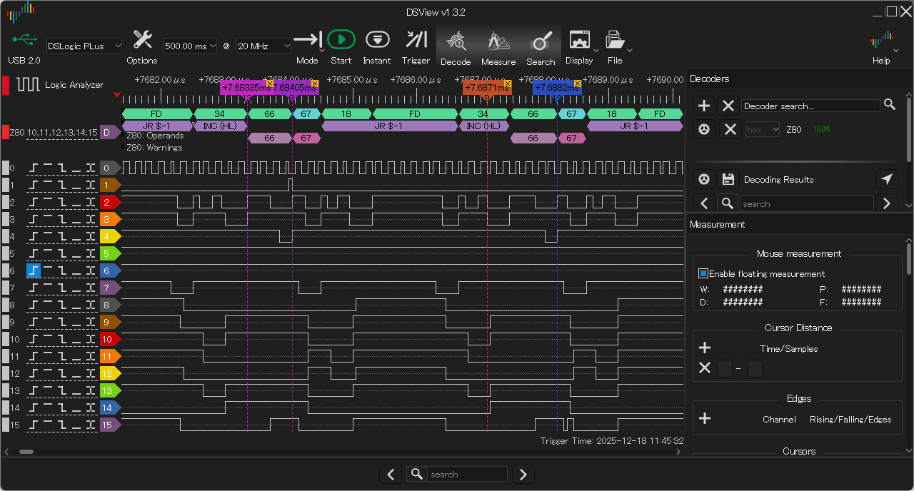
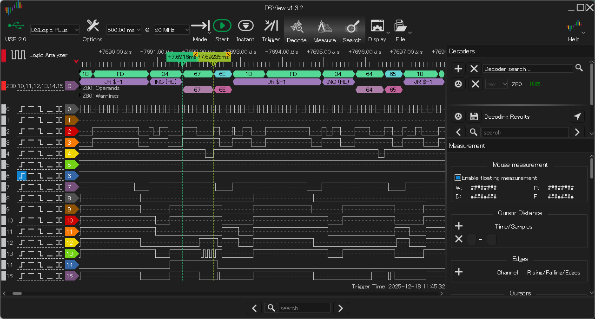
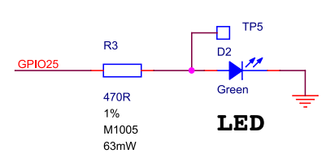
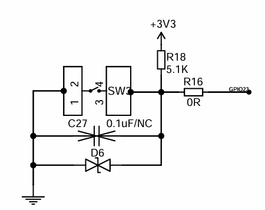
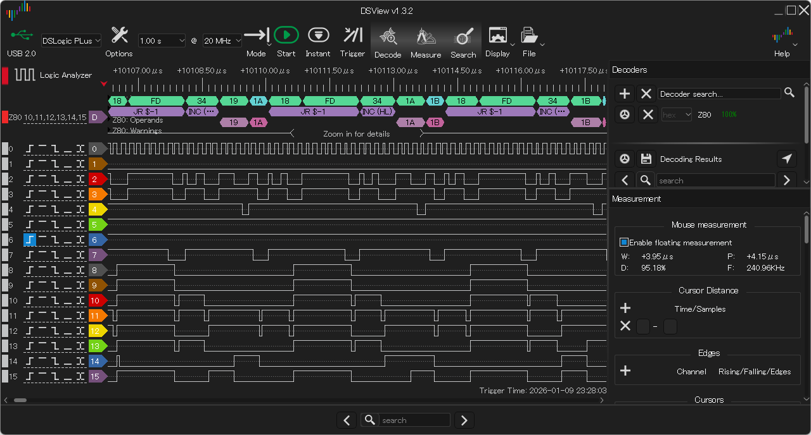

# EMUZ80_AE_RP2040 設計メモ

AE-RP2040基板によるトライ

## 数命令実行後、限られた値しかフェッチしなくなり、00、80などを実行してしまう。

アドレスバスを見る限り、正しく出しているように見える。いくつか振ってみたが、症状は変わらず。

## RP2040のERRATA-E5

* https://zenn.dev/koron/articles/f1b54678d90f76 に解説がある。
* USB デバイスコントローラがリセットから抜け出せない、対策のためGPIO15の先につながっているデバッグ回路を使う。対策には800us掛かる。その間はGPIO15は使えない。という話。AE-RP2040ではGPIO15 に RD 受信に使っているので、使えないタイミングが存在するのはまずい。
* ということで、データシートで示される回避策(`PICO_RP2040_USB_DEVICE_ENUMERATION_FIX=1`)を `CMakeFile.txt` で定義してみた。

```
set(PICO_RP2040_USB_DEVICE_ENUMERATION_FIX 1)
```

これにより、数命令しか実行できない、という状況はなくなったように見える。

## INC (HL) を連続して行ったとき、前の命令で書き込んだ値を次の命令のReadサイクルで読み出していない。



INC (HL)の2サイクル目でメモリ読み出し、３サイクル目で(インクリメントした値を)メモリ書き込みを行う。66をリードしてインクリメントして67を書き込んだ次の命令で、66を再度リードしている。

〇書き込みサイクルで書き込む値が1増えた値でない。



67をリード・インクリメントして書き出す値が6Eになっている。

〇ライトサイクルで、データバスの一部信号が安定していない。

上図のライトサイクルで、D2がぎざぎざになっている。

上記の問題はこの症状から引き起こされていると考えている。

残念ながらこの症状の原因究明・対策が打てていない。

> 後で示すとおり、PIO の IN 端子指定で COUNT が指定できない(無関係のビットも読み込んでしまう)ことが原因だった。

〇同じ回路で Pico2 を使うと、問題なく動作する。

AE-RP2040で動作させることができなかったので、メモリリード・ライトサイクル動作を確立するために、Pico/Pico2を使うことにした。WeAct RP2350B board を使いリードライトサイクルで苦労せず動作させることができていたので、RP2040 とRP2350A で動作の違いがあるなら、そこからヒントを得ようと考えたためである。

Pico/PIco2につなぐデータバスを11本(A0-A10)、2kB分だけに抑えると、Raspberry Pi Pico/Pico2 で Z80駆動ができる。EMUBASIC の動作は無理だが、数バイト～数十バイトの機械語プログラムなら 2kB あれば十分である。

|Pico/Pico2 GPIO|Z80 信号|
|---|---|
|GPIO0-10|A0-A10|
|GPIO11-18|D0-D7|
|GPIO19|/RD|
|GPIO20|/WR|
|GPIO21|/IORQ|
|GPIO22|/WAIT|
|GPIO26|/RESET|
|GPIO27|CLK|
|GPIO28|TEST|

Pico/Pico2 で端子に出ているGPIOすべてを使っている。

テストポイント5(TP5)にGPIO25が取れるが、OUTPUT(Pico/Pico2 -> Z80)として使うにしてもHigh出力ができないため、実質的に使えない。GPIO25 に High を出力しても、TP5の電圧は緑LEDの電圧降下は、1.8～2.2V 程度でこれ以上の電圧に上がらないので、Z80 入力に印可しても Highと認識される気がしない。

@DragonBallEZ さんの Pico2ROMEmuBR(https://github.com/kyo-ta04/Pico2ROMEmuBR)では、TP5から信号を引き出しているが、トランジスタを介してZ80のRESET駆動に使用しているのでさすがである。



私GPIO25をOUTPUT端子として使わなかったのは、OUTPUT端子として必要なのは/WAIT, /RESET, CLK の3本だけでGPIO26-28で足りているからである。

/WAIT,/RESET,CLKのいずれかをGPIO25に逃がしてINPUT端子(/RD,/WR,/IORQ)のいずれか1本をGPIO26-28に引っ越しさせて、A11をつないで4kBまで拡張することも考えられるが、今回はその手は使わなかった。

私は GPIO26-28 を INPUT 端子として使うつもりはない。この3端子は入力として使うときに 5V まで引っ張ることができない。抵抗を挟んで接続すれば大丈夫なのだが、High -> Low に引っ張るときに 100ns 程度掛かるらしいので、Z80 6MHz で駆動したい立場から避けたいと考えた。

TP5から引き出すと取り回しが面倒だというのもある。実験用の回路にそこまでする根性はなかった。

## RP2350 Pin Assign

ピン割り当てを変更し、

```
D0-D7: 24-31
RD,WR,IORQ,WAIT: 16,17,18,19
CLK,INT,RESET,BUSRQ: 40,41,42,43
```

とした。 

WeAct RP2350B CoreBoard で試作した際に、D0-D7: 16-23 と割り当てていたが、当初、D7 が High にならない問題が発生した。結局 CoreBoard 上のR18, D6, R16 をむしり取った後は期待通り動作した。

GPIO23 は、以下のようなスイッチ回路となっており、プルアップ抵抗または D6 により電圧が十分上げられない(または下げられない)問題が発生していた。



RP2350B CoreBoard は安価に手に入る(980円で買える)ので、これを使えるようにしたい。よって、GPIO23 を使わずに済むピン割り当てを考えて、上記に至った。

従来 16-21 だったデータバスを GPIO24-31 に移す。GPIO25 は LED が接続されているが、こちらは問題なく動作する。GPIO16-23 は Z80 の制御信号(Z80側の出力端子)を割り当てる。現状 Z80 制御出力で必要なものは、 RD,WR,IORQの3本で、WAITは制御入力(RP2350B側から見ると出力)なので、GPIO40以後に割り当てるのが原則だが、なんとなくGPIO16-23 の範囲で割り当てた。足りなくなるとGPIO40以後に移してもよいかもしれない。

Pimoroni RP2350B 基板での試作は動作している。

### CLK端子を RP2350B GPIO端子と直結した。

Z80 の CLK 端子は入力電圧範囲が厳しく、High 時に 3.5V 以上を要求する。そう考えて 74HC00 を挟んでドライブしていたのだが、今回は 74HC00 ゲートなしの直結で動作させている。

これでも動作する様子なのでよいだろう。@vintagechips さんの EMUZ80 に敬意を表して、秋月B基板サイズ上に Z80 と RP2350B のみを載せて2チップのみで動作させたい。ゲートを挟まずCLKと直結して動作するかを試してみた。

## RP2040 と RP2350 との差異

Z80 + Pico/Pico2 で挙動を比較した。

Pico2だと動くが、Picoだと動かない。

Z80クロックを変えると挙動が変わる。フェッチするデータが大きく変わったり、WR時のD1だけぶるぶる震えたりする。

### RP2040/RP2350の挙動を調べる。

データシートを見比べる。
RP2350データシートの「RP2040との違い」の説明の中に、`mov dst, pins` の時のデータが

```
RP2350: in_countビットより上はマスクされる。
RP2040: マスクされず32ビット分のデータを読み込む
```

とある。これだ。

※2つの記述を並べて和訳を付ける。

`mov pc, pins` なので、ステートマシンのプログラムカウンタに直接代入する。この値が 0 か 1か(2以上にならない)ことを想定してPIO機械語プログラムを組んでいる。RP2350は `IN_COUNT = 1` として、ビット0のみ入力され、ビット１以上は0となるようにしている。

RP2040では、`IN_COUNT` フィールドが存在しないので、(API関数もない)指定しようがない。RDの上位ビットのピンの値も読み込まれて、PCに代入されてしまう。アドレス2以上にはコードを置いていないので、何を実行するのか予測できない。多分そういうことが生じているのだろう。

* PicoROMのコードでは、CE/OEの上位ビットはD0-D7がある。
* D0-D7に対して、inover の値を LOW としている。
* inoverとは、GPIO入力したときの各ピンの扱い、LOWとは「常に0」とするということ。
* PicoROMでは、D0-D7は「出力に用いる、データの読み込みはしない」ので、「読み込んだら常に0とする」でも構わない。

PicoROMでは、ピン配置を工夫することで、下位2ビットのみを確実にPCに代入するようにしている、と思われる。

本システムではどうするか？出力ピン4本の手前にRDをつなげばよいが、出力4本は存在しない。AE-RP2040ならば、

|||
|---|---|
|29|CLK
|28|RESET
|27|WAIT
|26|RD

ピン26はADCで5V耐性はないが、1kΩ抵抗を直列に接続することで壊れず動作する事例が報告されているので、それを使う。RP2040はGPIOは30本で、GPIO30,31は存在しない。存在しないピンは読み込むとゼロになるはず、なので、GPIO27,28,29に inover LOWを指定することで動くはず。

試作で使用しているPicoでは、

||||
|---|---|---|
|19|RD
|20|WR
|21|IORQ
|22|WAIT

だが、RDとIORQを入れ替えると、RDの上は、

|22|Out|WAIT
|23|Out|SMPS Power Save Pin
|24|In|VBUS sense
|25|Out|user LED

となる。22,23,25は出力ピンなので入力オーバライドをLowに固定しても構わない。inover Lowとすると、pindir プログラムをアドレス8,9に割り当ててやればうまく動作しそうだ。

GPIO24も inover LOW にして起動するかのあたりも見ておこう。動作するなら、現状通りアドレス0,1に割り当てられる。

|||
|---|---|
|19|RD
|20|WR
|21|IORQ
|22|WAIT
|23|(SMPS Power Save in)

RDの上4ビットのうち、WAITに input override が効くようにできれば、

```
.program set_pindirs
.origin 0
.side_set 4 pindirs
    mov pc, pins side 0xf
    mov pc, pins side 0x0
    mov pc, pins side 0xf
    mov pc, pins side 0x0
    mov pc, pins side 0xf
    mov pc, pins side 0x0
    mov pc, pins side 0xf
    mov pc, pins side 0x0
```

PIO機械語で下3ビットをカバーすることで動作するはず。

```
    // input override
    gpio_set_input_enabled(WAIT_Pin, false);
    gpio_set_inover(WAIT_Pin, GPIO_OVERRIDE_LOW);
    gpio_set_slew_rate(WAIT_Pin, GPIO_SLEW_RATE_FAST);
```

を入れると input override が効くはずだ。

### input override を使ってみる

試したら、

```
pio_gpio_init(pio1, WAIT_Pin);
```

より下に置いたら動作した。上ではダメだった。
PicoROM のコードは、

```
        pio_gpio_init(prg_data_output.pio(), BASE_DATA_PIN + ofs);
        gpio_set_dir(BASE_DATA_PIN + ofs, true);
        gpio_set_drive_strength(BASE_DATA_PIN + ofs, GPIO_DRIVE_STRENGTH_2MA);
        gpio_set_input_enabled(BASE_DATA_PIN + ofs, false);
        gpio_set_inover(BASE_DATA_PIN + ofs, GPIO_OVERRIDE_LOW);
        gpio_set_slew_rate(BASE_DATA_PIN + ofs, GPIO_SLEW_RATE_FAST);
```

なので、`pio_gpio_init` の後ろで動かしている。これを見習って動作するようになった。



```
#if 1
    // inc (hl) loop
    mem[0] = 0x21; LD (HL),0080H
    mem[1] = 0x80;
    mem[2] = 0x00;
    mem[3] = 0x34; INC (HL)
    mem[4] = 0x18; JR  $-1
    mem[5] = 0xfd;
    mem[6] = 0x0;
#endif
```

このコードを動作させロジアナ結果を取った。
機械語命令も格納したとおり、WRの波形も乱れず、
`INC (HL)` でメモリ内容が確実にインクリメントされている。

## EMUBASIC を動かそう

Input override 対応でメモリR/Wサイクルは動作するようになった。

ピン配置が

||||
|---|---|---|
|24|RD|IN
|25|WR|IN
|26|IORQ|IN
|27|WAIT|OUT
|28|RESET|OUT
|29|CLK|OUT

なので、下3ビットに input override は掛けられない。よって、

```
.program set_pindirs
.origin 0
.side_set 4 pindirs
    mov pc, pins side 0xf
    mov pc, pins side 0x0
    mov pc, pins side 0xf
    mov pc, pins side 0x0
    mov pc, pins side 0xf
    mov pc, pins side 0x0
    mov pc, pins side 0xf
    mov pc, pins side 0x0
```

のように、機械語命令8個を並べて3ビット分のアドレスすべてをカバーするようにする。

RDとWRを入れ替えるとIN 2本OUT3本になるので、機械語命令を4個に減らすことができる。次にこれをトライする。

## シリアル出力を繰り返すとハマる。

tinyUSB CDC を疑ったりしたが、結局ロジアナで停止位置を確認すると、そもそも IO Read/Write の処理に全く入っていないことが分かった。

* ハングは常に OUT 命令の IOWriteサイクルで生じていた。WAITがかかるが解除されない。
* Core1 ループ中の IO Read Write 処理を TOGGLE で挟んでも、ハング時、IO Write サイクルで WAIT が効いている状態で、TOGGLEが入っていない。
* ここから、IO Read Write 処理に入らずに、その前で処理完結してしまっている。つまり、メモリライト処理に誤って入っていると分かった。
* RP2040では、IORQ を非FTピンに割り当てているので、1kΩ抵抗を直列に挟んでいる。この抵抗のおかげで、IORQ 信号が変化するエッジがなまり、その分 IORQ が遅れる。
* Z80のIO Read/Writeサイクルでは、Writeサイクルの場合、IORQ と WR は同時に Low になる。メモリWriteサイクルで、MREQ よりもWRがLow になるのと対照的である。このことに留意しておきたい。
* よって、IO Write サイクルで IORQ == High, WR == Low の状態が生じることになり、メモリライトサイクルに落ち込んだと考えた。

で、メモリリード処理とメモリライト処理の間に、`port = gpio_get_all();` を挟んだ。これで安定して動作するようになった。

クロック上限は、17.0 分周、3.90MHz (125MHz/2/17.0) で動作する。ASCIIART.BAS実行時間は、5分09秒だった。

## TODO

* 1kΩ抵抗を WR に入れる、IORQ 直結を試す。メモリライトが高速化できるのではないか。
* RP2040 の GPIO 端子を 5V系CPUにつなぐことについての説明を追記。
* RP2350A/B では、ADC非対応の端子は、「IOVDDに通電されていれば　5.25Vまで掛けてもよい」と明記されているが、RP2040 ではその旨の記載はない。よって通常のCMOS端子になる。
* 3.3V駆動のCMOS端子に5Vロジックをつなぐ場合、3.3V側OUT - 5V側INの場合は直結でよい、5V側OUT - 3.3V側INの場合は10kΩ程度の抵抗を挟むとよい、という話がある。5Vより低電圧ロジックを作るにあたり3.3Vと決めた際の背景の解説があり、その記述によるとそうらしい。
* 安全を考えると、GPIO26-29で入力として使用する端子以外、GPIO0-25も10kΩ抵抗を挟むべきである。が、RP2040でもGPIO0-25(FT端子)は、GPIO26-29(ADC端子)よりも静電気保護回路を強化している旨は明記されている。また、GPIO26-29をINとして使用する際に1kΩを挟んで動作している(シンクロ波形付き)事例も報告されているので、GPIO0-25は直結、26-29は、入力として使用する場合は1kΩを挟むことで、EMUZ80 の美学「Simple is Beautiful」に殉じることにした。
* 「動けばヨシ」を是としない場合は、本回路を無理に試さなくてもよい。RP2350B を使った2チップ構成で試していただければよいと思う。

## IORQ を GPIO25 に移して 1kΩ抵抗を挟む

IO Write サイクルで IORQ == High, WR == Low の状態が生じるのがよくない。

上記対処では、再度 `port = gpio_get_all()` することで安定状態の入力を得ていたが、

IORQ が Low になった時点で WR が Low になっていてほしい。両方直結だと 


