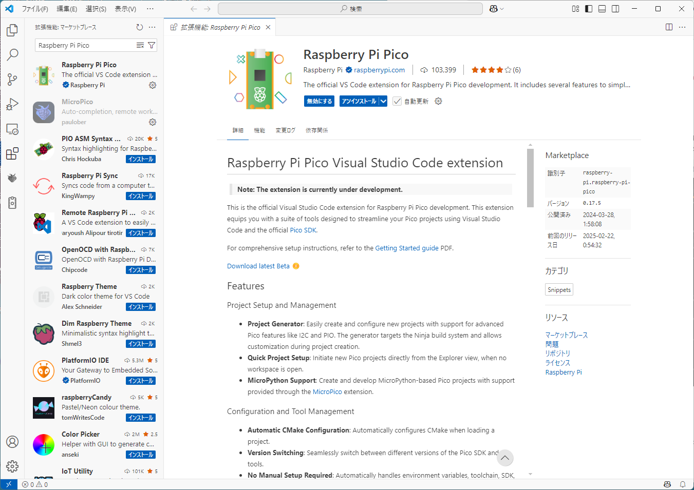
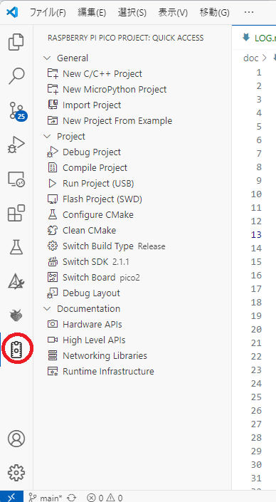
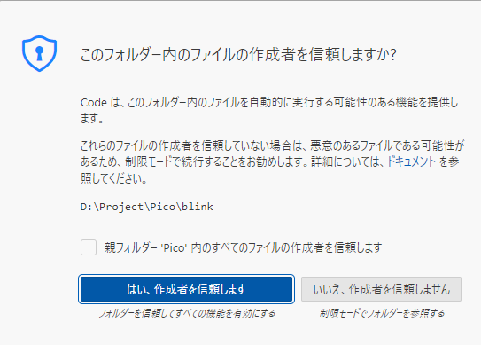
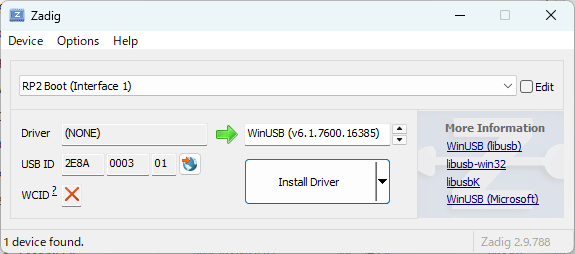
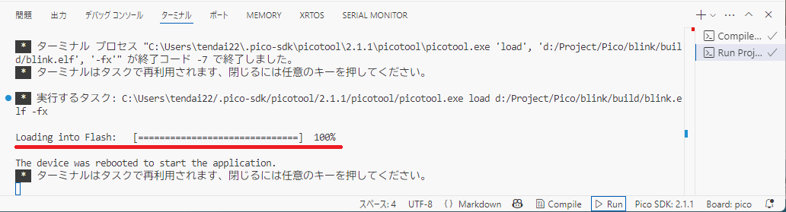
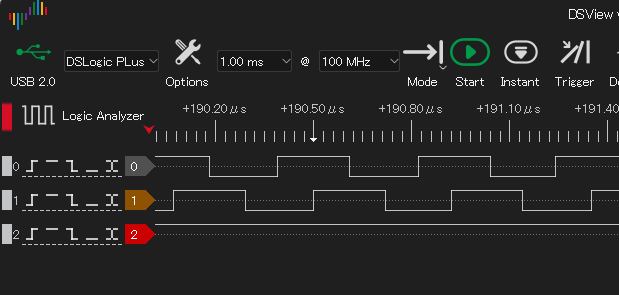
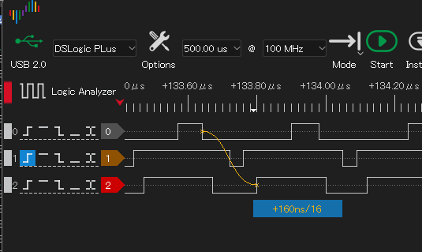
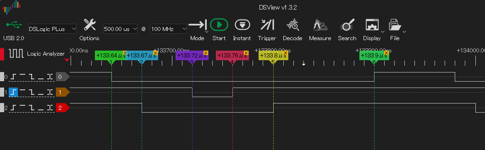
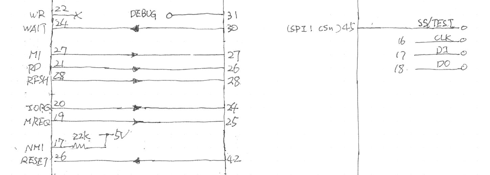
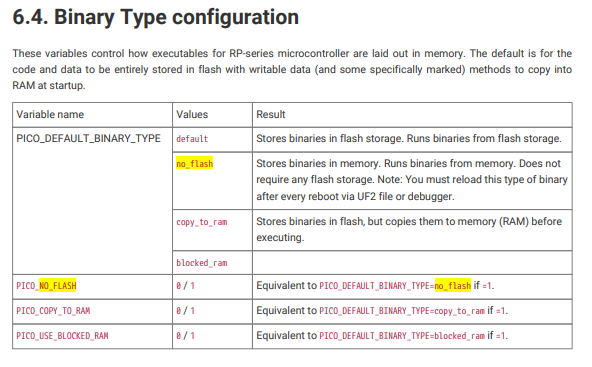

# 開発日記

## 環境構築(25/4/18)

Raspberry Pi Pico の環境構築は、

* VS code の拡張機能 Raspberry Pi Pico をインストールして、
* そこから New Project From Example で Lチカ(blink)を起こして、
* USBの先に Pico2 をつなぎ、BOOTSEL を押しながら電源を入れて、
* 画面下の "RUN" をクリックすると、ツールチェーンをダウンロード・インストール・サンプルのビルド・ダウンロード・実行してくれる。

非常に簡単になった。とすると、Windows 環境で開発するのが自然となるので、Windows 環境で進めることにした。

## step by step

#### 1. Raspberry Pi Pico 拡張機能

拡張機能画面で Pico を入れて検索する。



<div style="float: right; margin-left:1em;">

</div>

この拡張機能をインストールすると、アイコン列下側に Pico アイコンが追加される。

</section>


## 基板を作る。

PGA2350をB基板に載せてはんだ付けする。最初は Lチカを動かし、ダウンロードと PGA2350 の動作を確認した。

回路的には

* 電源は VBUS を PGA2350 の VBUS に直結。
* USB_DP, DM に USB コネクタ直結。
* BOOTSEL にスイッチにつなぎ GND に導通するようにする。抵抗不要。
* RUN にスイッチをつなぎ GND に導通するようにする。抵抗不要
* LED をGPIO25につなぐ。サンプル blink のデフォルトが GPIO25 なのだ。

これだけで動作した。PGA2350 よくできている。

## プロジェクトを作る

New C/C++ Project でプロジェクトを作る。

* hardware pwm
* pio
* uart

が欲しい。が、New C/C++ Project で指定できる機能は、"pio", "uart" のみなので、それを指定して入れた。

## プロジェクトを開く

<div style="float: right; margin-left: 1em;">

</div>

VScode で「フォルダを開く」でプロジェクトが開けるようだ。

ここで、「はい、作成者を信頼します。」で了解を入力することで、プロジェクトペインが左側に開く。

## デバイスをファーム書き込み可能状態にする

PGA2350 に USB ケーブルをつなぐ。

BOOTSEL 押しながらリセットボタンを押して離す。それで、ファームウェアダウンロード可能状態になるが、最初はそうならなかった。「デバイス初期化エラー」とかななんとか。

Zadig をダウンロードして起動する。"RB2 Boot" を選択し、 WinUSB を選択する。"Install Driver" を叩く。



これで、「BOOTSELを押しながらRUNを押して離す」で Pico2 が USB Mass Storage デバイスとして認識され、ドライブが一つ増える。うちの環境では E ドライブが湧いた。

この状態にならないと、ファームを書き込んで実行することはできない。

## ビルドとダウンロード

VS code 右下の「RUN」と書かれた小さな△をクリックする。


ソースコード下側にペインが開き、そこでコンパイル・ダウンロード状況が表示される。

'Loading into Flush' が表示され、それが100%になればダウンロード開始成功で、デバイスはすでにプログラム実行開始している。　



## git for Windows を入れる。

インストーラをダウンロードして実行するだけである。

いろいろ聞かれる。

## 試作

プロジェクト生成した。
* 名前: `emuz80_pico2`
* Windows 環境で、Pico Exstension の "New C/C++ Project"
* uart, pio を使う、にチェックを入れた。

## ビルド、実機動作

* BOOTSEL押しながらRUN押して話すと書き込み可能モード
* 下右のRUNをクリックすると、ビルド&&ダウンロード&&リセット

* PIO Lチカは動作する(ピン25)
* シリアルが出てこない。
* uart1, pin42, 43 使用で出てこなかった。
* `gpio_set_function` で、 `UART_FUNCSEL_NUM(UART_ID, UART_TX_PIN)` マクロを使うようにすると出るようになった。
* `uart_puts` での出力は出た。`printf` は出なかった。
* 調べてみると、標準入出力は uart0 がデフォルトらしい。
* ピン配置を変えて、pin46, 47 を使うようにすると printf も表示されるようになった。
* コード見てみると、`stdio_init_all();` でなく、`void stdio_uart_init_full(struct uart_inst *uart, uint baud_rate, int tx_pin, int rx_pin) ` 呼び出しで行けそうな気もする。今度試してみよう。

## pin41 に PIO Lチカが出力できない。

* `pio_set_gpio_base(pio, base);` を最初に呼び出すだけではだめらしい。ぱっと見に行けそうな気がしたのだが。
* pico-c-sdk のコードを見ると結構複雑なことをやっている。
+ pico-examples でも pio で 32ピン以上を使っている例が見つからない。
* 各関数終了時に、構造体メンバに何が設定されているかを printf で見ながら進めよう。

## gpio.h の説明

###  General Purpose Input/Output (GPIO) API

RP-series microcontrollers have two banks of General Purpose Input / Output (GPIO) pins, which are assigned as follows:

#### rp2040_specific

RP2040 has 30 user GPIO pins in bank 0, and 6 QSPI pins in the QSPI bank 1 (QSPI_SS, QSPI_SCLK and QSPI_SD0 to QSPI_SD3). The QSPI pins are used to execute code from an external flash device, leaving the User bank (GPIO0 to GPIO29) for the programmer to use. 

#### rp2350_specific

The number of GPIO pins available depends on the package. There are 30 user GPIOs in bank 0 in the QFN-60 package (RP2350A), or 48 user GPIOs in the QFN-80 package. Bank 1 contains the 6 QSPI pins and the USB DP/DM pins.

All GPIOs support digital input and output, but a subset can also be used as inputs to the chip’s Analogue to Digital Converter (ADC). The allocation of GPIO pins to the ADC depends on the packaging.

* RP2040 and RP2350 QFN-60 GPIO, ADC pins are 26-29.
* RP2350 QFN-80, ADC pins are 40-47.
 
Each GPIO can be controlled directly by software running on the processors, or by a number of other functional blocks.

The function allocated to each GPIO is selected by calling the `gpio_set_function` function. 

> Note: Not all functions are available on all pins.

* Each GPIO can have one function selected at a time. Likewise, each peripheral input (e.g. UART0 RX) should only be selected on
* one _GPIO_ at a time. If the same peripheral input is connected to multiple GPIOs, the peripheral sees the logical OR of these GPIO inputs. Please refer to the datasheet for more information on GPIO function select.

#### Function Select Table

##### rp2040_specific

On RP2040 the function selects are:

| GPIO   | F1       | F2        | F3       | F4     | F5  | F6   | F7   | F8            | F9            |
|--------|----------|-----------|----------|--------|-----|------|------|---------------|---------------|
| 0      | SPI0 RX  | UART0 TX  | I2C0 SDA | PWM0 A | SIO | PIO0 | PIO1 |               | USB OVCUR DET |
| 1      | SPI0 CSn | UART0 RX  | I2C0 SCL | PWM0 B | SIO | PIO0 | PIO1 |               | USB VBUS DET  |
| 2      | SPI0 SCK | UART0 CTS | I2C1 SDA | PWM1 A | SIO | PIO0 | PIO1 |               | USB VBUS EN   |
| 3      | SPI0 TX  | UART0 RTS | I2C1 SCL | PWM1 B | SIO | PIO0 | PIO1 |               | USB OVCUR DET |
| 4      | SPI0 RX  | UART1 TX  | I2C0 SDA | PWM2 A | SIO | PIO0 | PIO1 |               | USB VBUS DET  |
| 5      | SPI0 CSn | UART1 RX  | I2C0 SCL | PWM2 B | SIO | PIO0 | PIO1 |               | USB VBUS EN   |
| 6      | SPI0 SCK | UART1 CTS | I2C1 SDA | PWM3 A | SIO | PIO0 | PIO1 |               | USB OVCUR DET |
| 7      | SPI0 TX  | UART1 RTS | I2C1 SCL | PWM3 B | SIO | PIO0 | PIO1 |               | USB VBUS DET  |
| 8      | SPI1 RX  | UART1 TX  | I2C0 SDA | PWM4 A | SIO | PIO0 | PIO1 |               | USB VBUS EN   |
| 9      | SPI1 CSn | UART1 RX  | I2C0 SCL | PWM4 B | SIO | PIO0 | PIO1 |               | USB OVCUR DET |
| 10     | SPI1 SCK | UART1 CTS | I2C1 SDA | PWM5 A | SIO | PIO0 | PIO1 |               | USB VBUS DET  |
| 11     | SPI1 TX  | UART1 RTS | I2C1 SCL | PWM5 B | SIO | PIO0 | PIO1 |               | USB VBUS EN   |
| 12     | SPI1 RX  | UART0 TX  | I2C0 SDA | PWM6 A | SIO | PIO0 | PIO1 |               | USB OVCUR DET |
| 13     | SPI1 CSn | UART0 RX  | I2C0 SCL | PWM6 B | SIO | PIO0 | PIO1 |               | USB VBUS DET  |
| 14     | SPI1 SCK | UART0 CTS | I2C1 SDA | PWM7 A | SIO | PIO0 | PIO1 |               | USB VBUS EN   |
| 15     | SPI1 TX  | UART0 RTS | I2C1 SCL | PWM7 B | SIO | PIO0 | PIO1 |               | USB OVCUR DET |
| 16     | SPI0 RX  | UART0 TX  | I2C0 SDA | PWM0 A | SIO | PIO0 | PIO1 |               | USB VBUS DET  |
| 17     | SPI0 CSn | UART0 RX  | I2C0 SCL | PWM0 B | SIO | PIO0 | PIO1 |               | USB VBUS EN   |
| 18     | SPI0 SCK | UART0 CTS | I2C1 SDA | PWM1 A | SIO | PIO0 | PIO1 |               | USB OVCUR DET |
| 19     | SPI0 TX  | UART0 RTS | I2C1 SCL | PWM1 B | SIO | PIO0 | PIO1 |               | USB VBUS DET  |
| 20     | SPI0 RX  | UART1 TX  | I2C0 SDA | PWM2 A | SIO | PIO0 | PIO1 | CLOCK GPIN0   | USB VBUS EN   |
| 21     | SPI0 CSn | UART1 RX  | I2C0 SCL | PWM2 B | SIO | PIO0 | PIO1 | CLOCK GPOUT0  | USB OVCUR DET |
| 22     | SPI0 SCK | UART1 CTS | I2C1 SDA | PWM3 A | SIO | PIO0 | PIO1 | CLOCK GPIN1   | USB VBUS DET  |
| 23     | SPI0 TX  | UART1 RTS | I2C1 SCL | PWM3 B | SIO | PIO0 | PIO1 | CLOCK GPOUT1  | USB VBUS EN   |
| 24     | SPI1 RX  | UART1 TX  | I2C0 SDA | PWM4 A | SIO | PIO0 | PIO1 | CLOCK GPOUT2  | USB OVCUR DET |
| 25     | SPI1 CSn | UART1 RX  | I2C0 SCL | PWM4 B | SIO | PIO0 | PIO1 | CLOCK GPOUT3  | USB VBUS DET  |
| 26     | SPI1 SCK | UART1 CTS | I2C1 SDA | PWM5 A | SIO | PIO0 | PIO1 |               | USB VBUS EN   |
| 27     | SPI1 TX  | UART1 RTS | I2C1 SCL | PWM5 B | SIO | PIO0 | PIO1 |               | USB OVCUR DET |
| 28     | SPI1 RX  | UART0 TX  | I2C0 SDA | PWM6 A | SIO | PIO0 | PIO1 |               | USB VBUS DET  |
| 29     | SPI1 CSn | UART0 RX  | I2C0 SCL | PWM6 B | SIO | PIO0 | PIO1 |               | USB VBUS EN   |

##### rp2350_specific

On RP2350 the function selects are:

| GPIO  | F0   | F1       | F2        | F3       | F4     | F5  | F6   | F7   | F8   | F9           | F10           | F11      |
|-------|------|----------|-----------|----------|--------|-----|------|------|------|--------------|---------------|----------|
| 0     |      | SPI0 RX  | UART0 TX  | I2C0 SDA | PWM0 A | SIO | PIO0 | PIO1 | PIO2 | XIP_CS1n     | USB OVCUR DET |          |
| 1     |      | SPI0 CSn | UART0 RX  | I2C0 SCL | PWM0 B | SIO | PIO0 | PIO1 | PIO2 | TRACECLK     | USB VBUS DET  |          |
| 2     |      | SPI0 SCK | UART0 CTS | I2C1 SDA | PWM1 A | SIO | PIO0 | PIO1 | PIO2 | TRACEDATA0   | USB VBUS EN   | UART0 TX |
| 3     |      | SPI0 TX  | UART0 RTS | I2C1 SCL | PWM1 B | SIO | PIO0 | PIO1 | PIO2 | TRACEDATA1   | USB OVCUR DET | UART0 RX |
| 4     |      | SPI0 RX  | UART1 TX  | I2C0 SDA | PWM2 A | SIO | PIO0 | PIO1 | PIO2 | TRACEDATA2   | USB VBUS DET  |          |
| 5     |      | SPI0 CSn | UART1 RX  | I2C0 SCL | PWM2 B | SIO | PIO0 | PIO1 | PIO2 | TRACEDATA3   | USB VBUS EN   |          |
| 6     |      | SPI0 SCK | UART1 CTS | I2C1 SDA | PWM3 A | SIO | PIO0 | PIO1 | PIO2 |              | USB OVCUR DET | UART1 TX |
| 7     |      | SPI0 TX  | UART1 RTS | I2C1 SCL | PWM3 B | SIO | PIO0 | PIO1 | PIO2 |              | USB VBUS DET  | UART1 RX |
| 8     |      | SPI1 RX  | UART1 TX  | I2C0 SDA | PWM4 A | SIO | PIO0 | PIO1 | PIO2 | XIP_CS1n     | USB VBUS EN   |          |
| 9     |      | SPI1 CSn | UART1 RX  | I2C0 SCL | PWM4 B | SIO | PIO0 | PIO1 | PIO2 |              | USB OVCUR DET |          |
| 10    |      | SPI1 SCK | UART1 CTS | I2C1 SDA | PWM5 A | SIO | PIO0 | PIO1 | PIO2 |              | USB VBUS DET  | UART1 TX |
| 11    |      | SPI1 TX  | UART1 RTS | I2C1 SCL | PWM5 B | SIO | PIO0 | PIO1 | PIO2 |              | USB VBUS EN   | UART1 RX |
| 12    | HSTX | SPI1 RX  | UART0 TX  | I2C0 SDA | PWM6 A | SIO | PIO0 | PIO1 | PIO2 | CLOCK GPIN0  | USB OVCUR DET |          |
| 13    | HSTX | SPI1 CSn | UART0 RX  | I2C0 SCL | PWM6 B | SIO | PIO0 | PIO1 | PIO2 | CLOCK GPOUT0 | USB VBUS DET  |          |
| 14    | HSTX | SPI1 SCK | UART0 CTS | I2C1 SDA | PWM7 A | SIO | PIO0 | PIO1 | PIO2 | CLOCK GPIN1  | USB VBUS EN   | UART0 TX |
| 15    | HSTX | SPI1 TX  | UART0 RTS | I2C1 SCL | PWM7 B | SIO | PIO0 | PIO1 | PIO2 | CLOCK GPOUT1 | USB OVCUR DET | UART0 RX |
| 16    | HSTX | SPI0 RX  | UART0 TX  | I2C0 SDA | PWM0 A | SIO | PIO0 | PIO1 | PIO2 |              | USB VBUS DET  |          |
| 17    | HSTX | SPI0 CSn | UART0 RX  | I2C0 SCL | PWM0 B | SIO | PIO0 | PIO1 | PIO2 |              | USB VBUS EN   |          |
| 18    | HSTX | SPI0 SCK | UART0 CTS | I2C1 SDA | PWM1 A | SIO | PIO0 | PIO1 | PIO2 |              | USB OVCUR DET | UART0 TX |
| 19    | HSTX | SPI0 TX  | UART0 RTS | I2C1 SCL | PWM1 B | SIO | PIO0 | PIO1 | PIO2 | XIP_CS1n     | USB VBUS DET  | UART0 RX |
| 20    |      | SPI0 RX  | UART1 TX  | I2C0 SDA | PWM2 A | SIO | PIO0 | PIO1 | PIO2 | CLOCK GPIN0  | USB VBUS EN   |          |
| 21    |      | SPI0 CSn | UART1 RX  | I2C0 SCL | PWM2 B | SIO | PIO0 | PIO1 | PIO2 | CLOCK GPOUT0 | USB OVCUR DET |          |
| 22    |      | SPI0 SCK | UART1 CTS | I2C1 SDA | PWM3 A | SIO | PIO0 | PIO1 | PIO2 | CLOCK GPIN1  | USB VBUS DET  | UART1 TX |
| 23    |      | SPI0 TX  | UART1 RTS | I2C1 SCL | PWM3 B | SIO | PIO0 | PIO1 | PIO2 | CLOCK GPOUT1 | USB VBUS EN   | UART1 RX |
| 24    |      | SPI1 RX  | UART1 TX  | I2C0 SDA | PWM4 A | SIO | PIO0 | PIO1 | PIO2 | CLOCK GPOUT2 | USB OVCUR DET |          |
| 25    |      | SPI1 CSn | UART1 RX  | I2C0 SCL | PWM4 B | SIO | PIO0 | PIO1 | PIO2 | CLOCK GPOUT3 | USB VBUS DET  |          |
| 26    |      | SPI1 SCK | UART1 CTS | I2C1 SDA | PWM5 A | SIO | PIO0 | PIO1 | PIO2 |              | USB VBUS EN   | UART1 TX |
| 27    |      | SPI1 TX  | UART1 RTS | I2C1 SCL | PWM5 B | SIO | PIO0 | PIO1 | PIO2 |              | USB OVCUR DET | UART1 RX |
| 28    |      | SPI1 RX  | UART0 TX  | I2C0 SDA | PWM6 A | SIO | PIO0 | PIO1 | PIO2 |              | USB VBUS DET  |          |
| 29    |      | SPI1 CSn | UART0 RX  | I2C0 SCL | PWM6 B | SIO | PIO0 | PIO1 | PIO2 |              | USB VBUS EN   |          |

GPIOs 30 through 47 are QFN-80 only:

| GPIO | F0 | F1       | F2       | F3        | F4      | F5  | F6   | F7   | F8   | F9       | F10           | F11      |
|------|----|----------|----------|-----------|---------|-----|------|------|------|----------|---------------|----------|
| 30   |    | SPI1 SCK | UART0 CTS | I2C1 SDA | PWM7 A  | SIO | PIO0 | PIO1 | PIO2 |          | USB OVCUR DET | UART0 TX |
| 31   |    | SPI1 TX  | UART0 RTS | I2C1 SCL | PWM7 B  | SIO | PIO0 | PIO1 | PIO2 |          | USB VBUS DET  | UART0 RX |
| 32   |    | SPI0 RX  | UART0 TX  | I2C0 SDA | PWM8 A  | SIO | PIO0 | PIO1 | PIO2 |          | USB VBUS EN   |          |
| 33   |    | SPI0 CSn | UART0 RX  | I2C0 SCL | PWM8 B  | SIO | PIO0 | PIO1 | PIO2 |          | USB OVCUR DET |          |
| 34   |    | SPI0 SCK | UART0 CTS | I2C1 SDA | PWM9 A  | SIO | PIO0 | PIO1 | PIO2 |          | USB VBUS DET  | UART0 TX |
| 35   |    | SPI0 TX  | UART0 RTS | I2C1 SCL | PWM9 B  | SIO | PIO0 | PIO1 | PIO2 |          | USB VBUS EN   | UART0 RX |
| 36   |    | SPI0 RX  | UART1 TX  | I2C0 SDA | PWM10 A | SIO | PIO0 | PIO1 | PIO2 |          | USB OVCUR DET |          |
| 37   |    | SPI0 CSn | UART1 RX  | I2C0 SCL | PWM10 B | SIO | PIO0 | PIO1 | PIO2 |          | USB VBUS DET  |          |
| 38   |    | SPI0 SCK | UART1 CTS | I2C1 SDA | PWM11 A | SIO | PIO0 | PIO1 | PIO2 |          | USB VBUS EN   | UART1 TX |
| 39   |    | SPI0 TX  | UART1 RTS | I2C1 SCL | PWM11 B | SIO | PIO0 | PIO1 | PIO2 |          | USB OVCUR DET | UART1 RX |
| 40   |    | SPI1 RX  | UART1 TX  | I2C0 SDA | PWM8 A  | SIO | PIO0 | PIO1 | PIO2 |          | USB VBUS DET  |          |
| 41   |    | SPI1 CSn | UART1 RX  | I2C0 SCL | PWM8 B  | SIO | PIO0 | PIO1 | PIO2 |          | USB VBUS EN   |          |
| 42   |    | SPI1 SCK | UART1 CTS | I2C1 SDA | PWM9 A  | SIO | PIO0 | PIO1 | PIO2 |          | USB OVCUR DET | UART1 TX |
| 43   |    | SPI1 TX  | UART1 RTS | I2C1 SCL | PWM9 B  | SIO | PIO0 | PIO1 | PIO2 |          | USB VBUS DET  | UART1 RX |
| 44   |    | SPI1 RX  | UART0 TX  | I2C0 SDA | PWM10 A | SIO | PIO0 | PIO1 | PIO2 |          | USB VBUS EN   |          |
| 45   |    | SPI1 CSn | UART0 RX  | I2C0 SCL | PWM10 B | SIO | PIO0 | PIO1 | PIO2 |          | USB OVCUR DET |          |
| 46   |    | SPI1 SCK | UART0 CTS | I2C1 SDA | PWM11 A | SIO | PIO0 | PIO1 | PIO2 |          | USB VBUS DET  | UART0 TX |
| 47   |    | SPI1 TX  | UART0 RTS | I2C1 SCL | PWM11 B | SIO | PIO0 | PIO1 | PIO2 | XIP_CS1n | USB VBUS EN   | UART0 RX |

機能番号11 が `GPIO_FUNC_UART_AUX` になっており、通常の番号2と異なる。機能番号2で CTS/RTS を割り当てられているピンを、機能番号11(`GPIO_FUNC_UART_AUX`)とすることで、TX/RX として使うことができる。

## pio_gpio_init

```
static inline void pio_gpio_init(PIO pio, uint pin) {
    check_pio_param(pio);
    valid_params_if(HARDWARE_PIO, pin < NUM_BANK0_GPIOS);
    gpio_set_function(pin, PIO_FUNCSEL_NUM(pio, pin));
}
```

なので、普通に `gpio_set_function` を呼び出しているだけだ。 `PIO_FUNCSEL_NUM` マクロは普通に pio0, 1, 2 を切り替えているだけで特に問題はない。

## pio_set_gpio_base

これは本質的に、

    pio->gpiobase = gpio_base;

やっているだけだが、

```
#if PICO_PIO_VERSION > 0
```

で条件コンパイルしているので、ライブラリ選択がうまくいっていないと pio->gpiobase が正しく設定されていない可能性がある。これは printf で調べてみたい。

## gpio32 以上で blink が動いた。

結局、`sm_config_set_set_pins` の内部(正確には、 `sm_config_set_set_base` 内)で、gpiobase の補正を掛けていないことが問題だった。

```
   sm_config_set_set_pins(&c, pin - pio_get_gpio_base(pio), 1);
```

と pin を gpiobase だけ減らすことで、ピン番号 41 で Lチカが動くようになった。

> `pio_sm_set_consecutive_pindirs` 内部ではピン番号を補正しているので、こちらでも補正すべきと思うのだが。

## ステートマシン 2 個めを動かす

次は、ステートマシン2個を動かすことを試みる。1個を WAIT 生成器、2個目をクロックジェネレータとして使いたい。

6800, 6809 などの2相クロック生成に向いていそう。これらCPUはクロック伸ばしで WAIT を掛けるので、それとの連携にも向いている。PWM を読んで調べるのもめんどうくさい。

それも、同一 pio / ステートマシン2個で動かせるとよい。レトロCPU対応が PIO 1 個で収まるならありがたい。

## WAIT生成器のイメージ

1. メモリアクセス開始を待つ。Z80 なら MREQの立下り、 6809 なら Eの立ち上がり。
2. 条件をチェックする。Z80 の場合、RFSH == H であること。6809ならVMAビットを見る。また、アドレスデコードが必要ならここで行う。
3. ステータスビットを取り出して、RX FIFO に突っ込む。IN 命令。Z80 の場合、RD を入れる。
4. ソフト側は、RX FIFO をブロッキング待ちしている。そこから返ってくるので、返し値を解釈してメモリリード、ライトを呼び分ける。
5.  データバスの読み込み、書き出し(この場合GPIO0-7 のdirection も書き換える)を負えると、TX FIFO に「終わったよ」印でなにかデータを書き込む。
6.  PIO側は、TX FIFO待ち状態にある(OUT)、
7.  OUT命令から抜けてきたら、WAIT信号を解除する。6809ならEクロックを再開する。
8.  IN命令でメモリアクセス完了を待つ。Z80 なら MREQ の立ち上がり、6809 なら Eの立下り。
9.  メモリアクセス完了を受けて、GPIO0-7 の direction を IN に変える。
10. 最初に戻る。

これをステートマシン1個で実現する。

間違いなく 10命令以上、16命令ぐらい使いそうだ。PIO 1つで最大 32 命令のはずなので、なんとか入りそうだ。

## step by step

1. ステートマシン2つを動かす。blink 2個でいいだろう。
    + 1個めはクロックにする。
    + 2個めは将来の wait マシンにする。
2. 2個めのステートマシンを MREQ で起動する(wait mreq)
    + どこかのピンを立てて落とすだけ。
    + CLK を MREQ につなぎ、立下りエッジで動き出すことを確認する。
3. その前に、Z80 を NOP フリーランさせる。
    + RESET をトグル、BUSRQ, INT, NMI は High プルアップ。
    + CLK は1個目のステートマシンで発生させる。
    + D0-D7 は 10kでプルダウン(のちに 3.3V プルアップするので、抵抗まとめ先は切り替え考慮)。
    + WAIT はプルアップ
4. その前に、データバスの扱いを決める
    + PIOで IN/OUT を制御するのは PIODIRS レジスタか?ひょっとして、これ、PIO全体で1個しか使わない?
    + とすると、データバスの IN/OUT を制御するためには、D0-7 を GPIO16より上に割り当てる必要がある。
    + この方向でピンアサインを変えておくか。
    + アドレスバスは GPIO0-15 に割り当てる。
    + PIOで吸い出して RX FIFO 経由で CPU に食わせる？
    + RRXF0_PUTGET0 で FIFO をランダムアクセスして取り出す。
4. ソフト起動を確かめる。
    + RX FIFO に書き込み
    + ソフト側で TEST ピントグル

### とすると、

|||
|---|---|
|1. TESTピン|+ ソフト側で TEST ピントグル<br>+ GPIO45に割り当てた<br>+ 複数回数が波形に出てこない。
|2. ステートマシン2つを動かす。|+ blink 2個でいいだろう。<br>+ 1個めはクロックにする。<br>+ 2個めは将来の wait マシンにする。
|3. データバスの扱いを決める|+ PIOで IN/OUT を制御するのは PINDIRS レジスタか?<br>ひょっとして、これ、PIO全体で1個しか使わない?<br>+ とすると、データバスの IN/OUT を制御するためには、D0-7 を GPIO16より上に割り当てる必要がある。<br>+ この方向でピンアサインを変えておくか。<br>アドレスバスは GPIO0-15 に割り当てる。
|4. 2個めのステートマシンを<br> MREQ で起動する(wait mreq)|+ CLK を MREQ につなぎ、立下りエッジで動き出すことを確認する。
|5. Z80 を NOP フリーラン|+ RESET をトグル、BUSRQ, INT, NMI は High プルアップ。<br>+ CLK は1個目のステートマシンで発生させる。<br>+ D0-D7 は 10kでプルダウン(のちに 3.3V プルアップするので、抵抗まとめ先は切り替え考慮)。<br>+ WAIT はプルアップ
|6. ソフト起動を確かめる。|+ RX FIFO に書き込み
|7. おまけ|+ PIOで吸い出して RX FIFO 経由で CPU に食わせる？<br>+ RRXF0_PUTGET0 で FIFO をランダムアクセスして取り出す。

## クロックドライブのために 74HCゲートを入れる

EMUZ80 の 2 チップのエレガントさが失われるがやむを得ない。動き出すと LED を点灯させたくなるので、そのドライバも兼ねようと思う。

将来的には1チップゲート74AHC1G00W5, TC7S14F,LFとかで基板を起こすとすっきり行きそうだ。「1チップゲートはおやつに入りますか？」という質問はしない方向で進めたい。

## データバスの入出力

PIO を使う方向で考えている。

* GPIO16-23 に割り当てる。
* PINCTRL_OUT_BASE を16, PINCTRL_OUT_COUNT を 8 とすることで、out 命令で D0-D7 に書き出せる
* IN 命令のマッピング、PINCTRL_IN_BASE を 16 とすることで IN 命令で取り出せる。IN 命令のカウントを 8で指定することで1バイトのみ取り出しとできる。
* WAIT GPIO は PINCTRL_IN_BASE と別に絶対ピン番号で指定できるらしい。MREQ を待つこととする。

ステートマシンの PINCTRL レジスタ

|ビット|数|名前|説明|
|-----|---|----|----|
|31:29|3|SIDESET_COUNT|0-5の範囲で指定<br>0:すべて遅延扱い<br>5:すべてsideset扱い。<br>5ビット中上側がsidesetデータ、下側が遅延オペランド。|
|28:26|3|SET_COUNT|SET命令でアサートされるピンの数。0-5の範囲で指定。
|25:20|5|OUT_COUNT|OUT PINS, OUT PINDIRS, MOV PINS命令でアサートされるピンの数。0-32の範囲で指定する。
|19:15|5|IN_BASE|IN data bus命令のLSBにマッピングされるピン。
|14:10|5|SIDESET_BASE|sideset操作の影響を受けるLSBピン。
|9:5|5|SET_BASE|SET PINS, SET PINDIRS命令で影響を受けるLSBピン。
|4:0|5|OUT_BASE|OUT PINS, OUT PINDIRS命令で影響を受けるLSBピン。

CPUがデータバスアクセスの際に、読み込み用RX FIFOへの書き込みと、書き出し用TX FIFOからの読み出し、データバス展開(PINDIRSも変える)を行うPIOプログラムをステートマシン2に置いて使う感じかな。

あと、PINDIRSをall 0(IN)にするPIOプログラムもおいて、WAITマシンから叩く。

GPIOBASEレジスタはステートマシンごとではない、PIO ごとなので、やはり、GPIOBASE = 16 としている以上、D0-D7 はGPIO16以上に割り当てるしかない。

JMP PIN 命令のチェック先は EXECCTRL_JMP_PIN で指定できる。ステートマシンごとに1個、入力マッピングと別に使える。WAIT MREQ 後のチェックは、RD, RFSH と2本チェックが必要なので難しいが、どこかのピンは使えるかもしれない。

PULL 命令は (命令中のblkビットを立てておくと)、TX FIFOが空の場合はストールする。プログラムからのデータ待ちに使用できる。

Z80 からのライトサイクルで、データバスのデータを読み込むのにステートマシンが使える。WR 信号を使うとすると、それを WAIT して IN して PUSH する感じ。

使えなくても、WAITマシンが WR サイクル判定して delay 後に IN して PUSH したらいいか。

CPU側はWAITマシンの RX FIFO をブロック監視している。そこにステータスとデータこみで乗せる。

CPU側は単一イベント待ちにすべてのイベントを乗せたい。

* RDサイクルなら、RDステータスのみ、
* WRサイクルなら、WRステータスとデータ8ビット、
* INTAサイクルなら、INTAステータスのみ、
* シリアルポート受信もイベントとして乗せる。SERIAL_INステータスとデータ8ビット、

PIOで内蔵デバイスのステータスを見られないか。

ステートマシン間の同期には IRQ 命令を使える。IRQ0-3 ビットをセットした状態で待機に入り、クリアされると IRQ 命令から返る。

### 読み込み項目

1. まずはここから
  * WAIT 命令でMREQピン指定する
  * OUT命令でWAITピンを0にする
2. IRQ立ててソフト実行を再開
  * IRQ立てて、
  * TX FIFOデータ待ちに入る。

3. TX FIFOデータ待ち
  * OUT PINDIR ではOSRから8ビットシフトアウトする。ソフト側でTX FIFOに0xff or 0x0 を書き込んでデータバスの方向をソフトに指定させることにする。というか、この場所では常にPINDIRはin方向だ。

## データシート徒然

WRAP_TOP, WRAP_BOTTOM: あるステートマシンごとに機械語の最初と最後を示す。最後の JMP 命令が不要となる。ラベル .wrap_target, .wrap の値で取り出せるが、絶対アドレスなので、途中にプログラムをロードする際には、先頭アドレスからの調整が必要。

```
mm_pio->sm[0].execctrl =
    (auto_push_pull_wrap_target << PIO_SM0_EXECCTRL_WRAP_BOTTOM_LSB) |
    (auto_push_pull_wrap << PIO_SM0_EXECCTRL_WRAP_TOP_LSB);
```

> これはオフセット調整しているようには見えないが。

ステートマシンの EXECCTRLレジスタのビットマップ:

|ビット|数||シンボル|説明|
|---|---|---|---|---|
|31|1|EXEC_STALLED|RO|INSTRに書き込まれた命令はストールされ、ステートマシンにラッチされる。この命令が完了すると0にクリアされる。
|30|1|SIDE_EN|RW|Delay/SidesetフィールドのMSBをsideset enable として扱う。
|29|1|SIDE_PINDIR|RW|1のとき、サイドセットはPINDIRにアサートされる。
|28:24|5|JMP_PIN|RW|JMP PINとして使うGPIO番号。
|23:19|5|OUT_EN_SEL|RW|inline OUT enable に使用するデータビット(?!)
|18|1|INLINE_OUT_EN|RW|1のとき、OUT dataの1ビットを補助書き込みイネーブルとして使用する。<br>0のとき、OUT_STICKYと組み合わせて使用すると、最新のpin書き込みを出アサートする。<br>(ステートマシン間の書き込み優先順位と組み合わせて使うらしい)
|17|1|OUT_STICKY:1のとき、最新のOUT/SETをpinsにアサートし続ける。
|16:12|5|WRAP_TOP|機械語がこのアドレスに達すると、WRAP_BOTTOMに巻き戻る
|11:7|5|WRAP_BOTTOM|WRAP_TOPから巻き戻る先、おそらくループ先端。
|6:5|2|STATUS_SEL|

## PIO 2つ

問題なく動いた。ステートマシン番号を 0, 1 としていなかったので、2度目の初期化で 1番目のステートマシンがリセットされていた。

```
    uint offset1 = pio_add_program(pio, &clockgen_program);
    clockgen_pin_forever(pio, 0, offset1, clk_pin, 10);
    uint offset2 = pio_add_program(pio, &wait_control_program);
    wait_control_pin_forever(pio, 1, offset2, wait_pin, 200000);
```

## gpio

結局、

```
    gpio_set_dir(TEST_PIN, true);
    gpio_put(TEST_PIN, 0);
```

```
#define TOGGLE() do {    gpio_xor_mask64(((uint64_t)1)<<TEST_PIN); } while(0)
```

で佳かった。

ロジアナ(DSView v1.3.2)で、スレシホールド 0.8V だと TEST pin にノイズが乗るが、0.9Vなら大丈夫だった。

## 時間が一定しない。

```
    while (n-- > 0) TOGGLE();
    TOGGLE();
    TOGGLE();
    n = 100;
    while (n-- > 0) TOGGLE();
    TOGGLE();
    TOGGLE();

```

うーん、RAM 実行かなぁ。XIPで変動していることを疑っている。

## 4/25 wait gpio 25

クロック(clk_pin 41)をMREQ(pin 25)につないで、pin25 の 0, 1 を wait 命令でとらえてみる。

```
.wrap_target
    wait 0 gpio 25 [5]  ; pin 25
    set pins, 0     ; WAIT Low
    wait 1 gpio 25 [5]  ; pin 25
    set pins, 1    ; WAIT High
.wrap
```

これで CLK に 60ns 遅延する波形を WAIT(pin 31)に出力させることができた。

## 4/27 wait gpio 25

1. CMakeFile.txt の board 指定を pico2 から pimoroni_pga2350 にすると進んだ。

当初 pico2, これは PICO_PIO_USE_GPIA_BASE がゼロのまま。ライブラリの選択が 64ピン版だったらしく、
だめだった。

2. MREQ_Pin を `gpio_init(MREQ_Pin);` することが必要だった。これなしでは 無割り当て状態で、pin25が内部につながっていかなかった。

3. これで、wait 0 gpio 25 が動く。それどころか、wait 0 gpio 40 も動く。ボード指定を正しくすることが大事。

これで、CLK -> MREQ とつないでおいて、CLK に WAIT が追従するようになった。

* CLK のエッジに 40ns 遅れて wait が動く。以下のプログラムで。

```
.wrap_target
    wait 0 gpio 25  ; pin 25
    set pins, 0    ; WAIT Low
    wait 1 gpio 25  ; pin 25
    set pins, 1    ; WAIT High
.wrap
```

## TEST pin のノイズ

ノイズ(グリッジ)が乗っている。

* CLK, MREQ, WAIT が動くタイミングでひげがでる。
* ひげはLに貼り付けているときにでる。High に貼り付けているときはでない。
* VBUS - GND 間に 10uF 電解コンデンサを挟んだが改善しない。
* TEST Pin が 45 でも 10 でも同じように出る。
* ロジアナのスレシホールド 0.8V で出る。 1.3V で出なくなる。

## wait control

* MREQ Pin Low を待って起動
* WAIT Low
* ソフト側にイベント送付(push -> pio_sm_get_blocking(pio, 1))
* ソフト側は pio_sm_get_blocking から戻ってくる。
* アドレスバスを読み込み、READならデータバスにデータを載せる
  WRITEならデータバスからデータを読み込む(ここ未実装)
* 処理が終わると、pim_sm_put でメモリアクセス完了を通知する。
* PIO側では pull で終了イベント発生を知る。
* WAIT High にする。
* MREQ Pin High を待つ。本サイクル終了を待つ。

何もしないと、TX FIFO に１ワード何かが入っており、PIO側がうまくブロックしなかった。最初の pull noblock で読み出してフラッシュすることで、PIO側がうまくブロックするようになった。将来的にはC言語側で明示的にクリアするべき。

```
.program wait_control
    set pins, 1 [20]
    pull noblock    ; dummy pull for flush
.wrap_target
    wait 0 gpio 25  ; pin 25
    set pins, 0     ; WAIT Low
    push            ; notify an access occurs
    pull block      ; wait for cpu's process finished
    set pins, 1     ; WAIT High
    wait 1 gpio 25  ; sleep until this cycle ends
.wrap
```

```
    uint32_t dummy;
    while (true) {
        dummy = pio_sm_get_blocking(pio, 1);
        TOGGLE();
        sleep_us(1);
        pio_sm_put(pio, 1, dummy);
        TOGGLE();
    }
```

アドレスバスの読み込み、データバスの処理はまだ実装できていない。

## データバス処理

もう1つステートマシンを用意する。ステートマシン0, 1 はすでに OUT ピンを割り当てているため、D0-D7(GPIO16-GPIO23)をIN/OUTするには、別のステートマシンを用意してそこに割り当てる必要がある。

このステートマシンも MREQ ピンを待つ。

READ/WRITEを区別するには、RDピンを読んで分岐する。WRITEならデータバスを読み込み、RX FIFOにおく。ソフト側では pio_sm_get_blocking で２ワードを、１ワード目は all zero, 2ワードめで8bitデータを受け取る。READなら all one を返し、TX FIFO から8bitデータを取り出しデータバスに書き出す。PIODIRSにOUTをつけ、MREQ 1 を待つ。

MREQ 1 となると、PIODIRSをINにして、ループの最初に戻る。

sidesetをうまく使うとWAIT制御もできるかもしれない。

## ピン監視・操作命令の対象ピンの決まり方

> これらの各操作は GPIO の 4 つの連続した範囲の 1 つを使用し、各範囲のベースとカウントは各ステートマシンの PINCTRL レジスタで設定します。 OUT、SET、IN、およびサイドセット操作のそれぞれに範囲があります。 各範囲は、指定された PIO ブロック(RP2350 では 30 個のユーザ GPIO)にアクセス可能な GPIO のいずれかをカバーすることができ、範囲は重複することができます。

Index オペランドは5ビットあるので、連続4つまで・5ビット中2ビットしか使えないという制約は、GPIOマッパのハードウェア的都合かな。

WAIT, JMPのIndexは5ビット丸ごと有効です。PINCTRL_IN_BASE に0 or 16 を代入し、そこから連続32ピンしか使えない。

ちなみに、PINCTRL_IN_BASE に 16 を代入して、GPIO10に set pins 命令でクロック出力できたのはなんなんだろうか。謎。

* クロック生成でステートマシン1つ使う。set/sideset で最大連続2ビットを使う。現在は40, 41ピン。
* WAIT生成、バスRead/Write/OE制御で2つめのステートマシンを使う。使えると思う。
  + MREQ で wait する。もしくは MREQ/IORQ でビジーループ待ち。jmp pin で振り分ける。
  + RD,RFSHで jmp pin を使う。正規のメモリアクセス抽出と、Read/Write で処理を分ける。
  + IN/OUT は D0-D7 に割り当てる。8本の IN/OUT 命令と、OUT PINDIR でOE制御する。
  + メインCPUプログラムとのやりとりは、RX FIFO, TX FIFO を使う。Z80 WriteデータをRX FIFOで渡し、Z80 ReadデータをTX FIFOで受け付ける。
  + イベント発生もRX FIFOで渡す。RX FIFOの1つ目はRead/Write/MEM/IO/INTAフラグを渡す。Z80 Writeサイクルでは2つ目のデータを読み取る。Z80 ReadサイクルではRX FIFOを待ちに行かずにTX FIFOにデータを書き出し、ステートマシンがデータバスへの書き出しと、PINDIRの書き出しを行う。
  + 全て終わるとwait 1 MREQ し、MREQ が１に戻ったらPINDIRをall zeroにする。
* シリアルポートもステートマシン2つで実現すると、データ受信時のステータス改変ができるが、それは第２段階とする。最初は、メインCPU側でポーリングする。

ということで、PIO 各ベースの割り当て案。PINCTRLレジスタはステートマシンごとに存在する。

|type|SM|BASE|COUNT|description|
|---|---|---|---|---|
|SET|0|40|1 or 2|クロック発生をsidesetで行うように変更する。
|IN|0|25|1|クロックストレッチを行う場合、このピンを監視して0の間は止める。
|IN|1|16|8|データRead/Write/OE
|OUT|1|16|8|データRead/Write/OE
|SET|1|31|0|WAIT信号1ピンのみ(CPUによっては25,26,...と複数割り当ても想定している)
|PINCTRL_MOV_BASE|NA|NA|NA|とりあえずunused

## waitマシンの再構成

* MREQを待つ。
* RDで振り分ける。
* Read(Z80 Write)時には、RX FIFOにall zeroを書き込み、INしてpush
* Write(Z80 Read)時には、RX FIFOにall oneを書き込み、pullしてOUTする。OUT PINDIR alloneする。
* Read/Writeとも終わると、wait 1, MREQする。
* MREQが立ったら、OUT PINDIR allzero して先頭に戻る。

* RX FIFOにall zeroを書き込むには、
  + MOV ISR, NULL (or ~NULL)
  + PUSH

## pio 2個に分けなくても大丈夫

クロック生成とwait機械を同じPIOでできるか？

sm_config_set_in_pinsなどが smを引数に持たないので4sm共通ではないかと心配だったが、そうではなかった。

プログラムごとにset_set_pinsしているが、(41と31で)それなりに動いているようだ。少し謎。

## PIO設定後、runするまでの間のWAITを期待通りに設定できない

Low になってしまう。命令実行すると最初の命令でHighにしてあるが、事前にgpio_putでHighにしていてもLowになってしまう。

`pio_sm_set_pins64(pio, sm, pin);` を入れてみたが効果なし。

RESET Highまで waitマシンを止めておくことで無事 High に貼り付けることができた。

機械語先頭の `set pins 1` を抜くとゼロになった、失敗。

## メモリリードを組んでみた

動作しているかどうかは不明だが、まずコードを書いてみた。

```
.program wait_control
    set pins, 1     ; WAIT High
    pull noblock    ; dummy pull for flush
    wait 1 gpio 42  ; wait for RESET negate
    wait 1 gpio 25  ; assure MREQ High
.wrap_target
    wait 0 gpio 25  ; detect MREQ down edge
    set pins, 0     ; WAIT Low
    ; so far always READ
    mov x, ~NULL    ; set X to all one
    mov isr, X
    mov pindirs, x  ; pindir is (all one)out
    push            ; notify an access occurs
    pull block      ; wait for cpu's process finished
    out pins, 8
    set pins, 1     ; WAIT High
    wait 1 gpio 25  ; sleep until this cycle ends
    mov pindirs, NULL   ; D0-D7 reset to 3-state (input)
.wrap
```

これからデバッグ開始です。

## JMP PINは１本しかみられない

ここまで来て、考え直しが必要になった。

「1ステートマシンあたり、待ち1本に補助1本しか使えない」ことに気づいた。

これまでは、WAIT制御のPIOプログラム内部で、MREQ, IORQ を使ったポーリングや、RFSHサイクル時にアクセス処理しないを、GPIO見て条件分岐するJMPで行おうと思っていた。

が、JMP PIM 命令では、ステートマシンのレジスタ、EXECCTRL_JMP_PIN に書き込んだピン番号でしか飛べない。つまり、ステートマシンごとに1本しか使えない。

* メモリアクセス、IOアクセス(+INTA)の区別のため、それぞれにステートマシン1つを割り当てる。<br>SM0がMREQをwaitし、SM1がIORQをwaitする。
* ソフト側で IRQ を見て、メモリ・IOどちらのサイクルが始まったかを知る。<br>IRQ0, IRQ1を割り当てる。
* 対応するステートマシンのRX FIFOから読み出して、Read/Write/INTAサイクルかを知る。<br>IRQレジスタの値に2ビットマスクして、その値をステートマシン番号とすれば高速に計算できて良いだろう。
* SM0(MREQ監視)は、JMP_PINを26(RFSH_Pin)とし、Lowの時はループ最後のMREQ High待ちまで飛ぶ。
* SM0では、IN_BASEを27とする。これで、`in pins, 1`命令で、RDがビット1に得られ、この値をRX FIFOにpushする。
* SM1では、IN_BASEを27とする。`in pins, 2`命令で、RD,M1がビット0,1に得られる。
 
#### SM0: メモリアクセス制御

```
; 8 instructions
.wrap_target
   wait 0 gpio 25
   set pins, 0          ; WAIT Low
   jmp pin mreq_end     ; RFSH cycle, skip it
   in pins, 1           ; read pin26, RD
   push                 ; put it to RX FIFO
   irq wait 0            ; set IRQ0
; irq wait 0 でソフト側で IRQ0 reset させた方がいいかもしれない。
   set pins, 1          ; WAIT High 
.mreq_end
   wait 1 gpio 25
.wrap 
```

* WAITをLowにする。
* RDピンを読み取り push する。
* IRQ0を立てる。
* (データバスマシンがWAITをHighにするので)
* MREQ Highを待ち先頭に戻る。

### SM1: IORQアクセス制御

```
; 7 instructions
.wrap_target
   wait 0 gpio 24       ; IORQ
   set pins, 0          ; WAIT Low
   in pins, 2           ; read pin27,28, RD,M1
   push                 ; put it to RX FIFO
   irq wait 1            ; set IRQ1
; irq wait 1 でソフト側で IRQ0 reset させた方がいいかもしれない。
   set pins, 1          ; WAIT High
   wait 1 gpio 24
   irq nowait, 2        ; set IRQ2 for databus driver
.wrap
```

* WAITをLowにする。
* RD,M1ピンを読み取り push する。
* IRQ1を立てる。
* (データバスマシンがWAITをHighにするので)
* IORQ Highを待ち先頭に戻る。


### ソフト側のコード

* IRQ0, 1を監視する。2ビットをポーリングし、どちらかが立つと抜ける。
* SM0/SM1 RX FIFOから1ワード読み出し、モードを知る(Read/Write/INTA)
* Read: アドレスバスから16ビット取り出し、メモリ配列から該当バイトを読み込み、SM2 TX FIFO に書き込む。
* Write: アドレスバスから16ビット取り出し、SM3からデータバスを読み込み、メモリ配列に書き込む
* INTA: SM3に1バイト(割り込み命令)をTX FIFOキューで送り込み、バスに出力させる。

```
    while((sm_flag = (pio->irq & 0x3)) == 0)
        ;           // wait for IRQ0,IRQ1
    sm_flag--;      // MREQ ... 0, IORQ ... 1
    rw_flag = pio_sm_get_blocking(pio, sm_flag);   // flag equals corresponding sm number
                    // RD ... 0, WR ... 1, INTA ... 2 
                    // INTA should be inverted in PIO asm program
    switch (sm_flag == 0) {
    case 0:     // MREQ cycle
        if (rw_flag == 0) {
            // memory read cycle
        } else {
            // memory write cycle
        }
        break;
    case 1:     // IORQ cycle
        if (rw_flag == 0) {
            // memory read cycle
        } else {
            // memory write cycle
        }
        break;
    default:    // INTA cycle
        // INTA cycle ... put int vector
        break;
    }
    pio->irq = (pio->irq & ~3);     // clear IRQ0,1
```

## データバス制御

* SM2,SM3 でリードアクセス、ライトアクセスする。

SM2: リードアクセス

* PINDIR を all one にして、pull/out pins, 8して D0-D7 に出力する。
* IRQ2 を待つ。SM0,1がサイクル終了を教えてくれる。
* irq clear 2
* mov pindirs, null で D0-D7 を入力(Hi-Z)にする。

```
    pull                    ; wait for write data
    out pins, 8             ; put it to D0-D7
    mov pindirs, ~null      ; set PINDIR to all-one (output)
    irq wait 2              ; wait for MREQ/IORQ cycle end
    irq clear 2
    mov pindirs, null       ; set PINDIR to all-zero (input/Hi-Z)
```

SM3: ライトアクセス

* PINDIR は all zero のはず。
* in pins, 8/push して RX FIFO にデータを置く。
* IRQ2 を待つ。SM0,1がサイクル終了を教えてくれる。
* irq clear 2
* mov pindirs, null で D0-D7 を入力(Hi-Z)にする。

```
.wrap_target
    pull                    ; wait for data read start from mainCPU program
    in pins, 8              ; read D0-D7
    push                    ; send to mainCPU program
    irq wait 2              ; wait for MREQ/IORQ cycle end
    irq clear 2
.wrap
```

 ## デバッグしてみる。

 RD Low にしておいて、MREQ READ のみのデバッグ。

 初回の WAIT Low からメインCPUがデータを読み込んでいるが、IRQ 0 の先に行けていない感じ、WAIT Hign に戻っていない。

 IRQ の扱いを再確認、メインCPUからIRQ set しないといかんができていない。

 ## 4ステートマシンで33命令

 32命令の上限を超えている。

……かなり再構成したが、次の機会に。

## 2相クロック

clockgen を改造して2相出るようにした。

* 連続する2ピンを割り当てる。ここでは、pin40(CLK_Pin), pin41(INT_Pin)とする。
* 試作ボードでは INT_Pin はインバータでドライブしている。
* pio_gpio_init(pio, pin) をピン数だけ呼び出す。
* pio_sm_set_consecutive_pindirs(pio, sm, pin, 2, true); ピン数2を指定する。
* sm_config_set_set_pins(&c, pin, 2); ピン数2を指定する。
* PIOアセンブリコード

```
.program clockgen
.wrap_target
    set pins, 0   ; Turn LED on
    set pins, 1   ; Turn LED off
    set pins, 3
    set pins, 2
.wrap             ; Blink forever!
```

* set pins でバイナリを出力する。0,1,3,2 の順で出力することで2相出力となる。



## 周波数指定

* sm_config_set_clkdiv(&c, 9.42); 浮動小数点数で指定できる。
* レジスタ的には、整数部 16bit, 小数部 16bit で指定する。

## 2相クロックのコード

blink.pio のCソース部分

```
void clockgen_program_init(PIO pio, uint sm, uint offset, uint pin) {
   pio_gpio_init(pio, pin);
   pio_sm_set_consecutive_pindirs(pio, sm, pin, 1, true);
   pio_sm_config c = clockgen_program_get_default_config(offset);
   // set_set_pin_base should have been adjusted by pio->gpiobase
   // so far not so in set_set_pin_base();
   sm_config_set_set_pins(&c, pin, 1);
   sm_config_set_clkdiv(&c, 9.42);          // 16.0 ... 2.33MHz (420ns/cycle)
                                            //  9.42 ... 4.0MHz  (250ns/cycle)
   pio_sm_init(pio, sm, offset, &c);
}
```

## 単相2相の切り替え

`void clockgen_program_init(PIO pio, uint sm, uint offset, uint pin, uint phase)` のように、単相(`phase=1`)、2相(`phase=2`)を切り替えるための引数を追加した。

本来なら PIO プログラムも単相用に最適化するべきだが、2相命令も残してある。PIO ステートマシンとしては2相として動作しているが、出力ピンを1本に絞っているため単相に見える。

ROMエミュレータ(ブランチ `rom_emulation`)でMREQをエミュレートするために、Low:10, High:1 の割合のパルスを生成させている。

## out pins が出力されない。

データバス出力がでなかった。理由は、`pio_gpio_init(pio, pin)` が抜けていた。

```
    for (int i = 0; i < 8; ++i)
        pio_gpio_init(pio, 16 + i);
```

で動くようになった。

## ROMエミュレーション

CS, OE 端子を持ち、A0-A15, D0-D7 を持つ仮想的な ROM を考える。

RP2350B で PIO を用いて、アクセスタイム 160ns で動くことを確認した。


### 試行内容

RP2350で、以下の割り当てで試行した。

|name|GPIO|
|---|---|
|/CS|26|
|/OE|27|
|A0-A15|0-15|
|D0-D7|16-23|

PIOでステートマシン1つを用いる。ステートマシンの役割は、

* /CS の監視... Highの間はデータバスに出力しない。
* /OE の監視... /OE の下りエッジで ROM データの読み出しと出力を行う。
* メインCPUへの通知... アクセス開始を知らせる
* データの受け取り... メインCPUからデータバスに出力する値を受け取る。
* データバス出力の戻し... /OE の上りエッジを検出し、データバスを High-Z に戻す。

メインCPU側で、アドレスバスを読み込み、内部のバイト配列からROMデータを取り出し、PIOに渡す。

* アクセス開始の検出... PIOステートマシンのRX FIFOデータ到着を待つ。
* アドレスバスの読み込みとデータの取り出し。
* データをPIOステートマシンに送る ...TX FIFOにデータを書き込む。

### 信号のタイミング



MREQ・RD を模したクロック信号(0:灰色)を ROMエミュレータに加えた。茶色(1)は、メインCPU側のタイミング、赤(2)は、PIOコード側のタイミングを表す。

赤(2)の上りエッジは、「データ出力開始」を表す。「MREQ・RDの下りエッジ」から「データ出力開始」までの時間は約 160ns、これが ROM としてのアクセスタイムに相当する。



上図のタイミング(1,2,3,4,5,6)は以下の通り。コード内のコメント番号と対比させている。

|色|番号|間隔[ns]|説明|
|---|---|---|---|
|緑|1|0|アクセス開始(/OEの下りエッジ)
|青|2|30ns|PIOステートマシンが/OE下りエッジを検出、動作開始
|紫|3|50ns|メインCPUがPIOステートマシンからのイベント検出、動作開始
|赤|4|40ns|メインCPUが出力データをPIOステートマシンに送出完了
|黄|5|40ns|PIOステートマシンがデータバスに出力開始
|緑|6|100ns|アクセス完了(/OEの上りエッジ、Z80のデータラッチタイミング)

1から5までが160ns、これをアクセスタイムと見なす。

### PIOアセンブリコード

```
;
; PIO0.SM1 databus control(program databus)
;
; IN/OUT_BASE 16, IN/OUT_COUNT: 8(D0-D7)
; JMP_PIN: N/A(no need to output control pins)
; SET_BASE: 31 (debug pin)
; GPIO: CS: 26, OE: 27
; 12 instructions
.program databus
    pull noblock        ; dummy read
    mov pindirs, null   ; D0-D7 as input
    set pins, 1
.wrap_target
    wait 0 gpio 26
    wait 0 gpio 27      ; exit at detecting Timing 1
    set pins, 0         ; Timing 2 (Green)
    push                ; send an access event to mainCPU
    pull                ; wait for databus output data
    out pins, 8         ; put it to D0-D7
    mov pindirs, ~null  ; DO-D7 output
    set pins, 1         ; Timing 5 (Yellow)
    wait 1 gpio 27 [7]  ; hold time 50ns (8ns x 7)
    mov pindirs, null   ; D0-D7 Hi-Z
.wrap
```

メインCPU側のコード

```
    uint32_t addr, data;
    while(true) {
        pio_sm_get_blocking(pio, 1);    // wait for access event occurs
        TOGGLE();           // Timing 3 (Purple)
        addr = (gpio_get_all() & 0xffff);
        data = mem[addr];
        TOGGLE();           // Timing 4 (Red)
        pio_sm_put(pio, 1, data);
    }
}
```

アクセスタイム 100ns 以下も狙えるとの話もあったが、PIO と C-SDK を普通に使ったらこんなところだった。

この試行は Z80 駆動の試行も兼ねている。Z80のステータス信号解釈を入れるとアクセスタイムはさらに延びる。それでも 300ns 程度には収まりそうだ。期待できる。

## ピンアサインの見直し(5/7)

Z80 status を IORQ,MREQ,RD,M1 の4ビット連続するように配置を変えた(25/5/7 第6版)。MREQ/IORQ直結に戻した。HC00 のゲートは外した。

基板改修後にソフトを動かすことになる。



## EMUZ80 に戻る

Z80駆動に戻る。blink.pio を書き直して、

* クロック生成: PIO0:SM0
* MREQ検知: PIO1:SM0
* IORQ検知: PIO1:SM1
* データバス: PIO1:SM2

の3構成とした。これで PIO1は 30 命令、結構ギリギリ。

メインループ側は RD しか見ていない。さぼり版のコード。これでまず動作を確認する。

## RAM上関数 __time_critical_func(xxx)

関数名を `__time_critical_func(xxx)` で囲むだけで、隣家スクリプトの調整含めあんじょう良くやってくれる気配がある。後で試してみよう。

## Z80 実物を駆動する準備

ピンアサインの見直し・試作基板の再配線も完了した。

* databus プログラムの動作確認
  + 全体構成(但し irq の代わりに wait 25)の動作確認
  + mov pindirs, null/~null で入出力できることの確認
  + mainCPU側のソフトでデータバスデータを読み込める・書き込んだデータがD0-D7に現れることの角煮
* wait_mreq から databus プログラムの連鎖
  + IRQ0 ビットで wait_mreq から databus ループを起動できる。

ここまでできれば、Z80 を挿して無限 NOP 動作を試行できる。

### 全体構成

* rom_emulation から blink.pio を持ち込み。
* 変更した新しいピン割り当てに PIOプログラムを合わせる

### mainCPU への読み込み、書き出しデータが期待通りでない

mainCPU から書き出したデータがデータバスに現れない。D0-D7 のピンを 5V/GND につないでもダンプしたデータが変化しない。

* in pins, 8/push のダンプが 80000000 と上8bitに現れる。
* pull/out pins, 8 のD0-D2 3ビットロジアナ出力がゼロのまま。

うーん、シフト方向が適切でないらしい。

* in 側のシフトが右シフトになっている。これを左シフトに変える。
* out 側のシフトも左方向?

シフト方向は、

```
static inline void
sm_config_set_in_shift(pio_sm_config *c, bool shift_right, bool autopush, uint push_threshold);
```

第2引数が、shift_right (true: 右シフト、false: 左シフト)のようだ。

デフォルトの初期化では、

```
static inline pio_sm_config pio_get_default_sm_config(void) {
    pio_sm_config c = {};
#if PICO_PIO_USE_GPIO_BASE
    c.pinhi = -1;
#endif
    sm_config_set_clkdiv_int_frac8(&c, 1, 0);
    sm_config_set_wrap(&c, 0, 31);
    sm_config_set_in_shift(&c, true, false, 32);
    sm_config_set_out_shift(&c, true, false, 32);
    return c;
}
```

なので、in/out どちらも右シフトだ。

これはよくない。左シフトに変換すべき。

とりあえず、`sm_config_set_in_shift(&c, false, false, 32);` したら、mainCPU 側のダンプが 00, 80 など期待通りになった。

`sm_config_set_out_shift(&c, false, false, 32);` していないのだが、変更しているうちにそれなりに出力されるようになった。ちょっと変。

とりあえず、set_out_shift も設定するようにする。これで、

* RD_Pin を外から ON/OFF することで Z80 Read/Z80 Write 動作を切り替えできる。
* mainCPU からデータ書き出し(カウンタをインクリメントして書き出す)
* mainCPU でデータバスの読み込み(D0-D7のどこかの1本を 5V/GNDにつないでシリアルダンプに反映されるか)

ここまで動作確認ができた。

> set_in_shift, set_out_shift シフト方向を整える。

### set で2ピン出力ができない

WAIT_Pin(30)の次を DEBUG_Pin(31) とした。これは PIOステートマシンの機械語デバッグのためにトグルできるようにだ。`SET_BASE` を 30, `SET_COUNT` を(1から)2と設定することでできるはず。

と思ったが、ロジアナに出力が出てこない。

`pio_gpio_init(pio, DEBUG_Pin)` が抜けていた。これを入れることでトグルが見られるようになった。

> PIO初期化の最初で `pio_gpio_init()` 呼び出しを忘れないように。

### IRQ 連鎖

MREQ/IORQ の両方を監視する場合、wait 25, wait 24 は使えない。wait 25 で待つと、IORQ が Low になってもそこから抜け出せない。複数 PIN の OR 監視は難しい。

逆に、AND 監視(/MREQ・RFSH)なら、

```
wait 0 gpio 25  ; MREQ Pin
wait 1 gpio 28  ; RFSH Pin
```

とすれば、/MREQ・RFSH を満たすとここを抜けてくる。リフレッシュサイクルの間はここで足止めを喰らうはず。

> PIO では複数 PIN の OR 監視は難しい

現在のところ、IORQ 監視、MREQ 監視にステートマシンを1個ずつ割り当て、どちらかが検出すれば、databus プログラム用ステートマシンを起動する方法しか思いついていない。databus プログラム軌道には、IRQビットを用いる。

OR 監視のために、外部に NAND ゲートをおいても良い気もする。今回のプロジェクトでは 2 チップにこだわりたいので、敢えてステートマシン2個使うことにする。

## RAM 上で実行 copy_to_ram

`no_flash` オプションに似ているが、そのものずばりのオプションを見つけた。`copy_to_ram`



`pico_set_binary_type(...)` で指定できるようなので、`CMakeFile.txt` で指定するだけで良さそうだ。

## PIO uart で printf を使う。

* printf の出力先に独自デバイスを使う場合、`stdout_driver_t` 型を定義して、

```
stdio_driver_t stdio_uart = {
    .out_chars = stdio_uart_out_chars,
    .out_flush = stdio_uart_out_flush,
    .in_chars = stdio_uart_in_chars,
#if PICO_STDIO_UART_SUPPORT_CHARS_AVAILABLE_CALLBACK
    .set_chars_available_callback = stdio_uart_set_chars_available_callback,
#endif
#if PICO_STDIO_ENABLE_CRLF_SUPPORT
    .crlf_enabled = PICO_STDIO_UART_DEFAULT_CRLF
#endif
};
```

出力関数をメンバ `.out_chars` に設定しておいて、`stdio_set_driver_enabled` で設定すれば良さそうだ。 `stdio_driver_t` 型データはリストを形成して、 `printf` の際にリスト要素すべての `out_chars` を呼び出す様子。

```
void stdio_uart_init_full(struct uart_inst *uart, uint baud_rate, int tx_pin, int rx_pin) {
    uart_instance = uart;
    if (tx_pin >= 0) gpio_set_function((uint)tx_pin, UART_FUNCSEL_NUM(uart, tx_pin));
    if (rx_pin >= 0) gpio_set_function((uint)rx_pin, UART_FUNCSEL_NUM(uart, rx_pin));
    uart_init(uart_instance, baud_rate);
    stdio_set_driver_enabled(&stdio_uart, true);
}
```

最初は stdio_uart を使った出力として始めよう

## stdio_uart の uart status 処理

メインのメモリアクセス処理と同時に、uart チェックも行う。

* (!TXFULL || !RXEMPTY) ならばフラグを更新する。条件分岐すると遅くなるので、毎回この値を書き込めばいいだろう。Z80 から UART ステータスレジスタを読みに来ると、この値をデコードして(8251 status register のビットパターンに変換して)返す。

* 割込みを使う場合は、コントロールレジスタへの割込みイネーブル設定を解釈し、(!TXFULL || !RXEMPTY) の値が変わる。直前の値を保存しておき、違いがあれば割込み更新処理を起動する。
* ここまでくると、16回に1回程度に間引いてもよいだろう。

* (!TXFULL || !RXEMPTY) の値は以下の式で取る。

```
(uart_get_hw(uart)->fr & (UART_UARTFR_RXFE_BITS|UART_UARTFR_TXFF_BITS)) !=
    (UART_UARTFR_TXFF_BITS)
```

TXFF == 1 && RXFE == 0 が唯一だめな状態なので、この2ビットの値が TXFF でないならばtrueを返せばよい、と考える。

フラグの値(prev に保持して「直前の値と比較する」)は、

```
prev = (uart_get_hw(uart)->fr & (UART_UARTFR_RXFE_BITS|UART_UARTFR_TXFF_BITS)
```

でいいだろう。

> 5/8 今晩はここから。このあと、いよいよ Z80 をドライブする。

## out pins, 8 が D0 出力すると動かない

pioコードを減らしつつ様子を見ると、

```
;    jmp pin write_cycle ; jmp if RD == 1, delay as wait for WR assert
```

を有効にすると1発目で止まってしまう。無効にするとサイクルが動き続ける。

databus_program_init で JMP_PIN の初期化を忘れていた。

```
    pio_gpio_init(pio, 26);     // RD_Pin
    sm_config_set_jmp_pin(&c, 26);  // RD_Pin
```

を追加して、無事 out が動作するようになった。