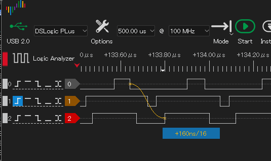
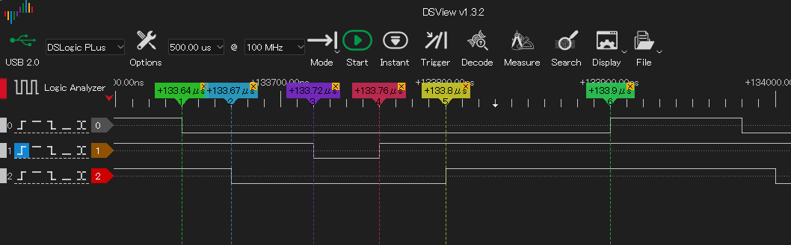

## ROMエミュレーション

Twitter で[こんなツイート](https://x.com/tendai22plus/status/1919205268535276025)をしたところ、いくつかコメントを頂いた。対話しながら、今ならすぐ試作できるなと思い、EMUZ80_Pico2 の試作ボードを使い ROM エミュレーションをやってみた。


アクセス機能の試作までで、実基板に挿して CPU と組み合わせて動作確認までは行っていない。

CS, OE 端子を持ち、A0-A15, D0-D7 を持つ仮想的な ROM を考える。

RP2350B で PIO を用いて、アクセスタイム 160ns で動くことを確認した。

### 試行内容

RP2350で、以下の割り当てで試行した。

|name|GPIO|
|---|---|
|/CS|26|
|/OE|27|
|A0-A15|0-15|
|D0-D7|16-23|

PIOでステートマシン1つを用いる。ステートマシンの役割は、

* /CS の監視... Highの間はデータバスに出力しない。
* /OE の監視... /OE の下りエッジで ROM データの読み出しと出力を行う。
* メインCPUへの通知... アクセス開始を知らせる
* データの受け取り... メインCPUからデータバスに出力する値を受け取る。
* データバス出力の戻し... /OE の上りエッジを検出し、データバスを High-Z に戻す。

メインCPU側で、アドレスバスを読み込み、内部のバイト配列からROMデータを取り出し、PIOに渡す。

* アクセス開始の検出... PIOステートマシンのRX FIFOデータ到着を待つ。
* アドレスバスの読み込みとデータの取り出し。
* データをPIOステートマシンに送る ...TX FIFOにデータを書き込む。

### 信号のタイミング



MREQ・RD を模したクロック信号(0:灰色)を ROMエミュレータに加えた。茶色(1)は、メインCPU側のタイミング、赤(2)は、PIOコード側のタイミングを表す。

赤(2)の上りエッジは、「データ出力開始」を表す。「MREQ・RDの下りエッジ」から「データ出力開始」までの時間は約 160ns、これが ROM としてのアクセスタイムに相当する。



上図のタイミング(1,2,3,4,5,6)は以下の通り。コード内のコメント番号と対比させている。

|色|番号|間隔[ns]|説明|
|---|---|---|---|
|緑|1|0|アクセス開始(/OEの下りエッジ)
|青|2|30ns|PIOステートマシンが/OE下りエッジを検出、動作開始
|紫|3|50ns|メインCPUがPIOステートマシンからのイベント検出、動作開始
|赤|4|40ns|メインCPUが出力データをPIOステートマシンに送出完了
|黄|5|40ns|PIOステートマシンがデータバスに出力開始
|緑|6|100ns|アクセス完了(/OEの上りエッジ、Z80のデータラッチタイミング)

1から5までが160ns、これをアクセスタイムと見なす。

### PIOアセンブリコード

```
;
; PIO0.SM1 databus control(program databus)
;
; IN/OUT_BASE 16, IN/OUT_COUNT: 8(D0-D7)
; JMP_PIN: N/A(no need to output control pins)
; SET_BASE: 31 (debug pin)
; GPIO: CS: 26, OE: 27
; 12 instructions
.program databus
    pull noblock        ; dummy read
    mov pindirs, null   ; D0-D7 as input
    set pins, 1
.wrap_target
    wait 0 gpio 26
    wait 0 gpio 27      ; exit at detecting Timing 1
    set pins, 0         ; Timing 2 (Green)
    push                ; send an access event to mainCPU
    pull                ; wait for databus output data
    out pins, 8         ; put it to D0-D7
    mov pindirs, ~null  ; DO-D7 output
    set pins, 1         ; Timing 5 (Yellow)
    wait 1 gpio 27 [7]  ; hold time 50ns (8ns x 7)
    mov pindirs, null   ; D0-D7 Hi-Z
.wrap
```

メインCPU側のコード

```
    uint32_t addr, data;
    while(true) {
        pio_sm_get_blocking(pio, 1);    // wait for access event occurs
        TOGGLE();           // Timing 3 (Purple)
        addr = (gpio_get_all() & 0xffff);
        data = mem[addr];
        TOGGLE();           // Timing 4 (Red)
        pio_sm_put(pio, 1, data);
    }
}
```

アクセスタイム 100ns 以下も狙えるとの話もあったが、PIO と C-SDK を普通に使ったらこんなところだった。

この試行は Z80 駆動の試行も兼ねている。Z80のステータス信号解釈を入れるとアクセスタイムはさらに延びる。それでも 300ns 程度には収まりそうだ。期待できる。

