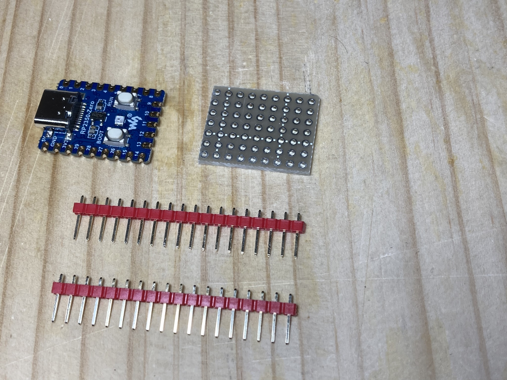
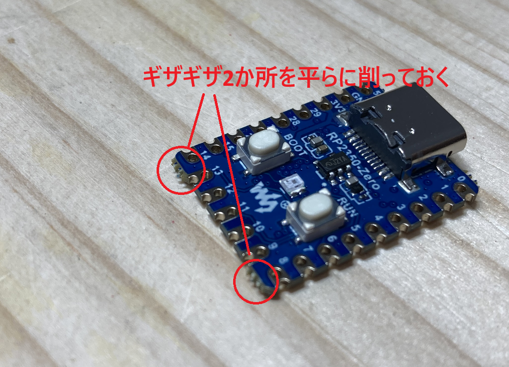
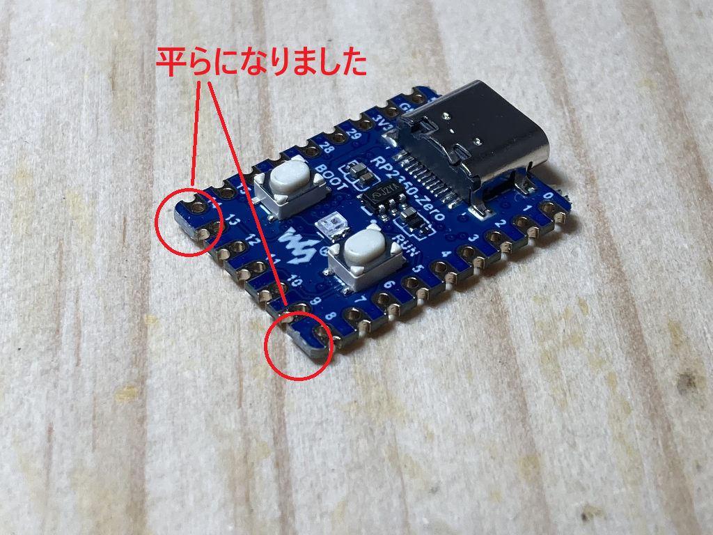
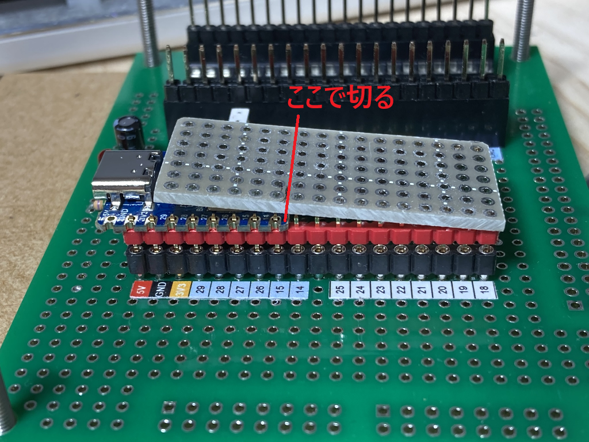
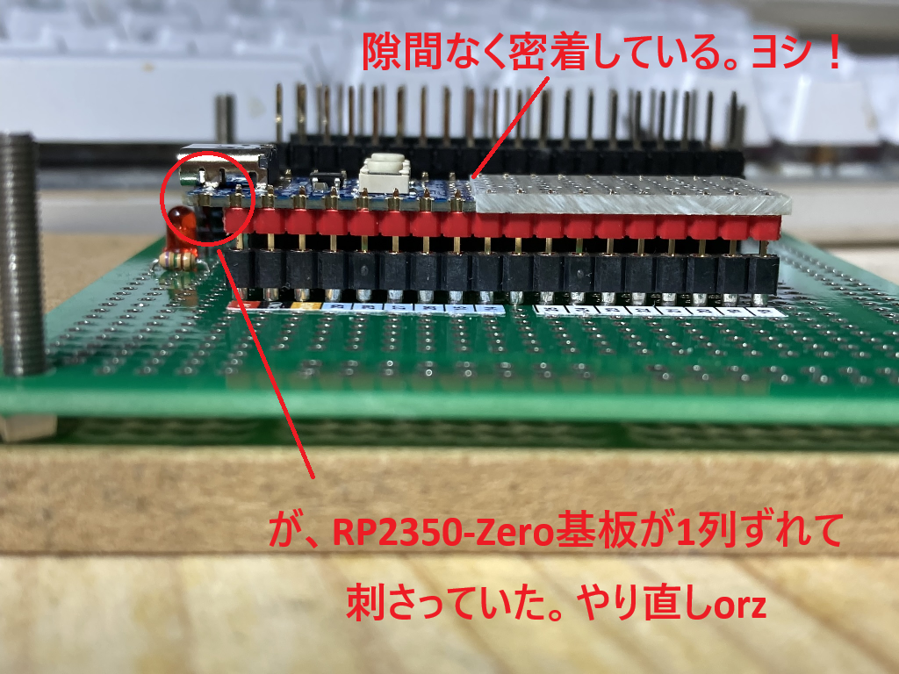
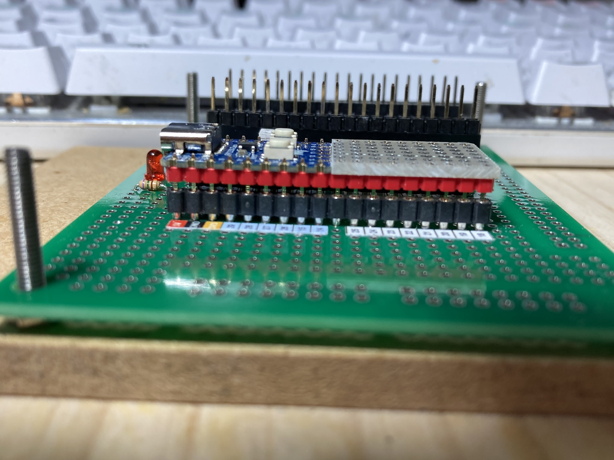
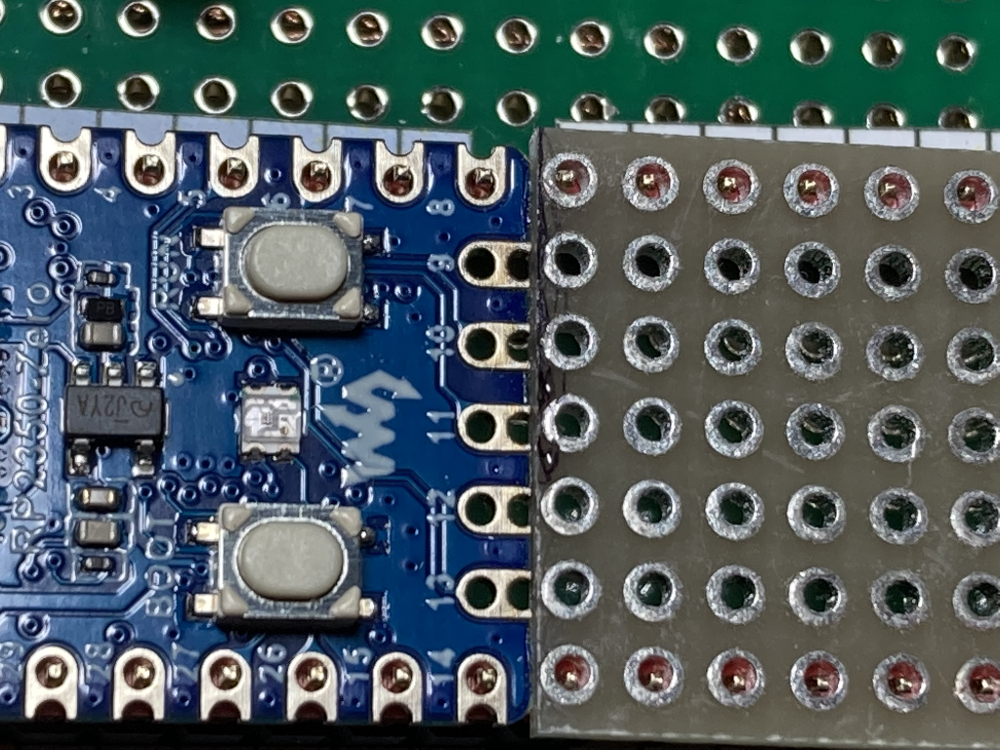
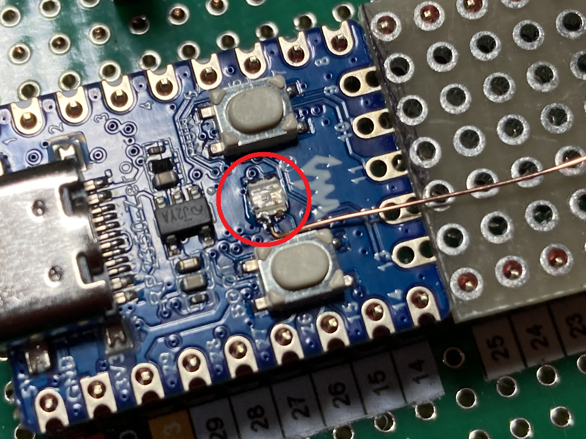
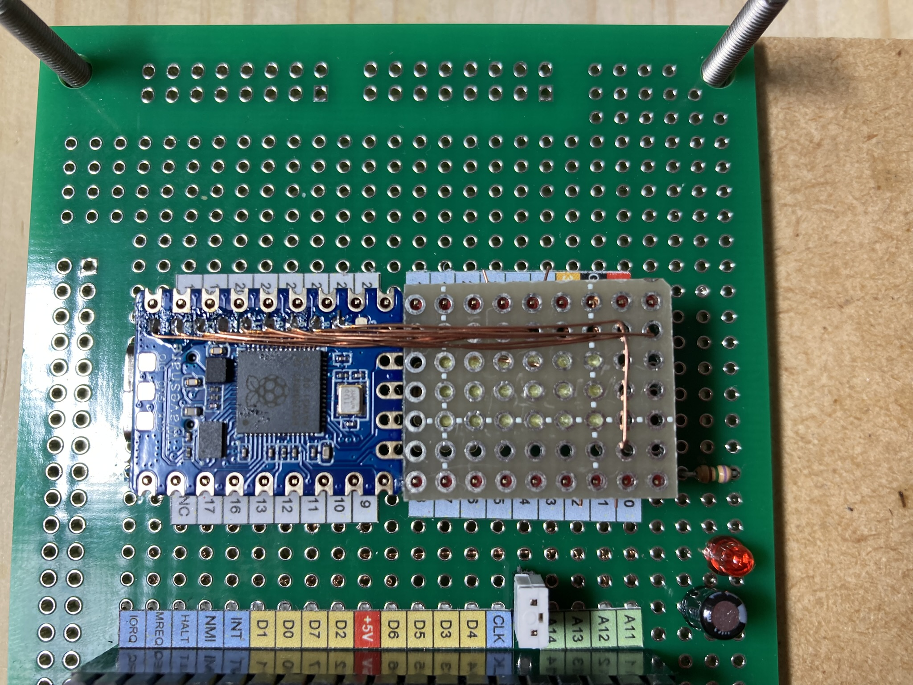

# RP2350AのGPIO全30本使える基板を準備する

我々レトロCPU遣いにとって、GPIOの数は極めて重要である。最もポピュラーな Raspberry Pi Pico/Pico2 (以後、"Pico/Pico2"と称す)は、GP23, 24, 25, 29の4本は端子に出ていない。

通常は、 [WeAct Studio RP2350B CoreBoard](https://github.com/WeActStudio/WeActStudio.RP2350ACoreBoard) など、RP2350B 搭載基板を使うことになる。が、一方で、Z80 を駆動するためには、30本あればアドレスバス16ビット、割り込み/BUSRQなしながら駆動できることが分かった。RP2040/RP2350A の GPIO端子すべてを使えばできるのだ。

できるなら EMUZ80 の2チップB基板サイズの美しさを再現できる。それを念頭に、GPIO 30 本出した基板を用意することを考えた。

RP2040ならば、秋月の [RP2040マイコンボード](https://akizukidenshi.com/catalog/g/g117542/) が 30本全部端子だししている。これを使い Z80 を駆動したのが `ae_rp2040` ブランチだが、一世代前のCPUである RP2040 を使うことでだいぶ苦労したし、Z80クロックは4MHzが上限だった。

やはり RP2350A を使いたい。RP2350A ならば、[`@74thの制作ログ`](https://74th.hateblo.jp/entry/2025/01/12/222618) に基板を自作する話がある。これは格好いいのだが、この微細はんだ付けをやりきる自信がなかったので、しり込みしていた。

先日、 [Waveshare RP2350-Zero](https://www.waveshare.com/rp2350-zero.htm) が GP16 を除く全29ピンが端子 or ランドに出ていることを知った。GP16 は WS2812B の DIN に接続されており、端子/ランド接続はないが、これ1本だけなんとか引き出せれば30本全部そろう。 じゃぁ、これを使って1枚基板を用意してみよう。

## 完成イメージ

40ピン DIP パッケージと同じ幅だが、ピン数は 36ピンである。

* RP2350-Zero 基板に、蛇の目基板の切れ端(ハギレ基板と呼ぶ)を接着して1枚板にしている。
* 接着部分のピンはNCである。

## 端子図

5V, GND, 3V3, GPIO0-29 の 33 本だが、後述の通り、中間に1列(2本)と、角に1個、計3本NC端子を設け、36ピンを 18ピン×2列で並べた。

## 部品を用意する

* RP2350-Zero 基板: 買ってください。SwitchScience で扱っています。
* 細ピンヘッダー 1x18 2本: 秋月のアソートパックを買って使っています。色付きなのでなんとなくおしゃれ。
* ハギレ基板: 7 x 9 穴・両面スルホールのもの。横9列は削って位置合わせするので、端は多めに残しておく。

* 写真のハギレ基板はカット済のものです。これより大きめのものを用意してください。

## ハギレ基板を切って、RP2350-Zero基板とエッジをぴったり接触するようにする。

瞬間接着剤で接着するので、エッジが隙間なくぴったり接触するようにしておくことが重要なのだ。

## RP2350-Zero 基板のエッジを整える

* エッジ2か所のバリをやすりで削り、端面が平らになるようにする。

 

## ハギレ基板の端を位置合わせする

* ピンヘッダ2本を 600mil 離して固定する。ブレッドボードに固定するより、丸ピンソケットに固定する方が良い。試作1号でブレッドボードで位置合わせして、最後に丸ピンソケットに差し込むときピンが合わずに差し込みに苦労した。ブレッドボードで位置合わせ、はんだ付けすると、どうしても各ピンに「揺れる」のだろう。

* 大きめに切ったハギレ基板を載せる。当然収まらず斜めになる。ここで切る位置の見当をつける。 切りすぎないようにやや大きめに切る。

* 見当をつけた位置で基板を切り落とし/ヤスリで削りながら、位置合わせを繰り返し、ピンヘッダ上に載せて、端面が隙間なく密着するように合わせる。

* ここで位置が一列ずれていることに気づいた。RP2350-Zero 基板を挿しなおして、ハギレ基板を更に1列削って合わせた。

## ハギレ基板と RP2350-Zero 基板を接着する。

* 竹串(スーパーで買った串揚げを食べた残りを有効活用しています)の先端に瞬間接着剤を載せて、基板端面に塗り、ピンソケット上で位置合わせしつつ指で押し付けて固まるまで待ちます。いい感じで接着できました。

## GP16をカラーLED端子から引き出す。

カラーLED端子に線1本はんだ付けしてGP16を引き出します。ここが一番の難所です。私もこて先をD型からB型に変更してピンポイントに対応します。

* ネットで見掛ける WS2816B の端子図とは異なるようです。VSS, VDD の位置を導通チェッカーで確認して、最終的には基板裏面のGP16端子とこの端子の導通を確認したうえではんだ付けして線を引き出します。
* あとで、GP16でLチカを実行して結線が正しいことを確認します。
* ピンヘッダはまだはんだ付けしません。この後基板裏側のパッド8個にはんだ付けします。ピンヘッダをはんだ付けしてしまったとすると、その時にこて先の取り回しが難しくなります。

## 裏面GP29～GP17パッドから線を引き出す。

基板を裏返してピンヘッダ上に載せます。いい感じに固定できます。

表側のピンヘッダはまだはんだ付けしません。線は基板表側に引き出して抜けないように曲げてあるだけです。

## 基板をピンヘッダにはんだ付けする。

ここで、基板の表側を上にしてピンヘッダに載せます。基板の各端子をピンにはんだ付けしてゆきます。

## 配線をピンにはんだ付けする。

* GP29-17 が穴から表側に出ています。(私はUEW線を使っているので) 線先端を新鮮なはんだで温め皮膜を飛ばしてから、ピンにはんだ付けしてゆきます。
* GP16 は、カラーLED端子から引き回した線をはんだ付けします。
* GP15,14は RP2350-Zero にすでに引き出されています。線をはんだ付けする必要はありません。
* GP13-9 は RP2350-Zero 基板の「小口」に出ています。ここからハギレ基板の対応端子にはんだ付けします。

これで基板作成は完了です。

## 動作確認

まず、ファームを書かずに通電すると、カラーLEDが三色Lチカしてくれます。

以下のファームを書き込みます。GP0 から順にLチカしてくれます。スペースバーをたたくと、次のピンに移ります。

GP16 は特に注意して確認してください。組み立て後にこれがチカらないと苦しいですが、頑張ってください。

